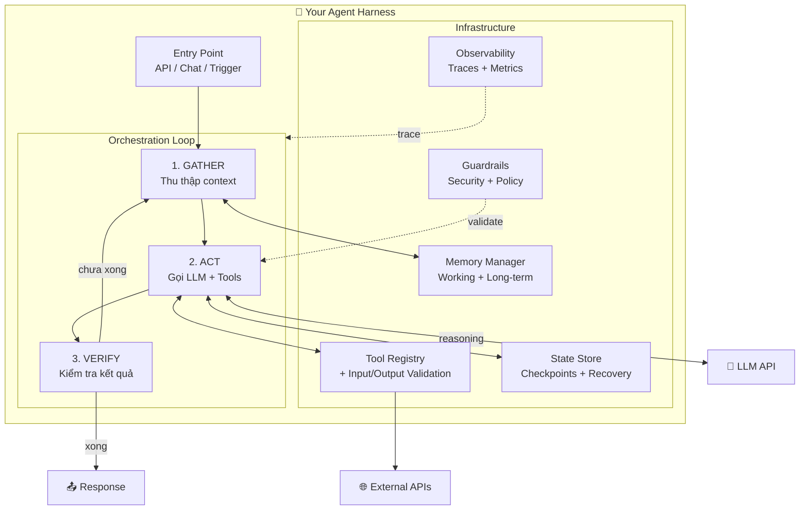

# Agent Harness — Triển Khai Thực Tế

> **Cập nhật:** Tháng 4/2026  
> **Tài liệu liên quan:** [agent-harness.md](./agent-harness.md) — Khái niệm cơ bản

---

## Mục Lục

1. [Câu Hỏi Quan Trọng: Tự Xây Hay Dùng Có Sẵn?](#1-câu-hỏi-quan-trọng-tự-xây-hay-dùng-có-sẵn)
2. [Bản Đồ Sản Phẩm: Ai Đã Triển Khai Harness?](#2-bản-đồ-sản-phẩm-ai-đã-triển-khai-harness)
3. [Phân Tích Chi Tiết Từng Sản Phẩm](#3-phân-tích-chi-tiết-từng-sản-phẩm)
4. [Khi Nào Cần Tự Xây Harness?](#4-khi-nào-cần-tự-xây-harness)
5. [Hướng Dẫn Triển Khai Harness Từ Đầu](#5-hướng-dẫn-triển-khai-harness-từ-đầu)
6. [Frameworks & SDK Hỗ Trợ](#6-frameworks--sdk-hỗ-trợ)
7. [Case Study: Xây Harness cho Agent Nội Bộ](#7-case-study-xây-harness-cho-agent-nội-bộ)
8. [Checklist Triển Khai](#8-checklist-triển-khai)

---

## 1. Câu Hỏi Quan Trọng: Tự Xây Hay Dùng Có Sẵn?

**Câu trả lời ngắn: Phụ thuộc vào bạn đang ở vai trò nào.**

```
┌─────────────────────────────────────────────────────────────────┐
│                   BẠN LÀ AI?                                    │
├─────────────────────────────────────────────────────────────────┤
│                                                                 │
│  👨‍💻 "Tôi là developer, muốn dùng AI để code nhanh hơn"        │
│  ──► DÙNG SẢN PHẨM CÓ SẴN (Cursor, Copilot, Cline...)         │
│  ──► Harness đã được xây sẵn cho bạn, chỉ cần dùng             │
│                                                                 │
│  🏗️ "Tôi muốn xây AI agent cho sản phẩm/công ty của mình"      │
│  ──► TỰ XÂY HARNESS bằng framework (LangGraph, ADK, Claude SDK)│
│  ──► Bạn là người thiết kế harness                              │
│                                                                 │
│  🔧 "Tôi muốn tự động hóa CI/CD pipeline"                       │
│  ──► DÙNG SẢN PHẨM CHUYÊN BIỆT (Harness.io, GitHub Actions AI) │
│  ──► Harness đã được tích hợp vào pipeline                      │
│                                                                 │
└─────────────────────────────────────────────────────────────────┘
```

> **Quy tắc vàng:** Đừng tự xây thứ mà người khác đã xây tốt hơn bạn.  
> Chỉ tự xây khi bạn cần harness **tùy chỉnh riêng** cho use case đặc thù.

---

## 2. Bản Đồ Sản Phẩm: Ai Đã Triển Khai Harness?

### Tổng quan tất cả các bên

```
                        ĐÃ TRIỂN KHAI HARNESS
                        ═══════════════════════
                        
  ┌─────────────── CODING AGENTS (IDE) ───────────────┐
  │                                                    │
  │  ✅ GitHub Copilot   — Pipeline-based, AGENTS.md   │
  │  ✅ Cursor           — Built-in tuned harness      │
  │  ✅ Windsurf         — Cascade engine              │
  │  ✅ Cline            — Open-source, MCP-native     │
  │  ✅ Claude Code      — Reference harness, hooks    │
  │                                                    │
  └────────────────────────────────────────────────────┘
  
  ┌─────────── AUTONOMOUS AGENTS (Cloud) ─────────────┐
  │                                                    │
  │  ✅ Devin            — Full VM, async delegation   │
  │  ✅ Google Jules     — Cloud VM, PR-based          │
  │  ✅ OpenAI Codex     — Hybrid local-cloud          │
  │  ✅ Amazon Q         — AWS-integrated agent        │
  │                                                    │
  └────────────────────────────────────────────────────┘
  
  ┌────────────── DEVOPS / PLATFORM ──────────────────┐
  │                                                    │
  │  ✅ Harness.io       — Pipeline-native agents      │
  │  ✅ GitHub Actions   — AI-powered workflows        │
  │                                                    │
  └────────────────────────────────────────────────────┘
  
  ┌──────── BUILD-YOUR-OWN FRAMEWORKS (SDK) ──────────┐
  │                                                    │
  │  🔧 LangGraph        — Stateful agent workflows   │
  │  🔧 Google ADK       — Model-agnostic framework   │
  │  🔧 Claude Agent SDK — Anthropic's agent toolkit  │
  │  🔧 OpenAI Agents SDK — OpenAI agent primitives   │
  │  🔧 CrewAI           — Multi-agent teams          │
  │  🔧 AutoGen / AG2    — Multi-agent conversation   │
  │  🔧 MS Agent Fwk     — Enterprise Semantic Kernel │
  │                                                    │
  └────────────────────────────────────────────────────┘
```

### Bảng so sánh chi tiết

| Sản phẩm | Loại | Harness Status | Bạn cần tự xây? | Customize được? |
|:---|:---|:---|:---|:---|
| **GitHub Copilot** | IDE Agent | ✅ Built-in | ❌ Không | ⚙️ Cao (`.github/copilot-instructions.md`, `AGENTS.md`) |
| **Cursor** | IDE Agent | ✅ Built-in (tuned) | ❌ Không | ⚙️ Cao (Rules, `.cursorrules`) |
| **Windsurf** | IDE Agent | ✅ Built-in (Cascade) | ❌ Không | ⚙️ Cao (Programmable rules) |
| **Cline** | IDE Extension | ✅ Built-in (OSS) | ❌ Không | ⚙️ Rất cao (BYO model, MCP, `.clinerules`) |
| **Claude Code** | CLI Agent | ✅ Built-in (Reference) | ❌ Không | ⚙️ Rất cao (Hooks, `CLAUDE.md`, MCP) |
| **Devin** | Cloud Agent | ✅ Built-in | ❌ Không | ⚙️ Trung bình |
| **Google Jules** | Cloud Agent | ✅ Built-in | ❌ Không | ⚙️ Trung bình |
| **OpenAI Codex** | Cloud Agent | ✅ Built-in | ❌ Không | ⚙️ Trung bình (AGENTS.md) |
| **Amazon Q** | Cloud Agent | ✅ Built-in | ❌ Không | ⚙️ Cao (AWS-native) |
| **Harness.io** | DevOps Platform | ✅ Built-in | ❌ Không | ⚙️ Cao (Custom Agents + OPA) |
| **LangGraph** | Framework | 🔧 Bạn tự xây | ✅ Có | ⚙️ Tối đa |
| **Google ADK** | Framework | 🔧 Bạn tự xây | ✅ Có | ⚙️ Tối đa |
| **Claude Agent SDK** | SDK | 🔧 Bạn tự xây | ✅ Có | ⚙️ Tối đa |
| **CrewAI** | Framework | 🔧 Bạn tự xây | ✅ Có | ⚙️ Tối đa |

> **Kết luận:** Hầu hết các sản phẩm AI phổ biến **đã xây harness sẵn** cho bạn. Bạn **không cần** tự xây trừ khi có nhu cầu đặc thù (xem [Mục 4](#4-khi-nào-cần-tự-xây-harness)).

---

## 3. Phân Tích Chi Tiết Từng Sản Phẩm

### 3.1 GitHub Copilot — "Từ Autocomplete đến Agent"

**Tiến hóa:**
```
2022: Autocomplete         → Không có harness, chỉ là model completion
2023: Chat mode            → Harness cơ bản (context + system prompt)  
2024: Workspace mode       → Harness trung cấp (codebase indexing + tools)
2025: Copilot Agent        → Harness đầy đủ (async, tools, verification loop)
2026: Agent + AGENTS.md    → Harness nâng cao (multi-agent, MCP, custom definitions)
```

**Kiến trúc Harness hiện tại (2026):**

```
┌─────────────────────────────────────────────────────────┐
│                 GITHUB COPILOT HARNESS                   │
├─────────────────────────────────────────────────────────┤
│                                                         │
│  Layer 1: ORCHESTRATION (Bộ não)                        │
│  ┌─────────────────────────────────────────────────┐   │
│  │ • Autonomous planning loop                       │   │
│  │ • System prompting (copilot-instructions.md)     │   │
│  │ • AGENTS.md — định nghĩa vai trò cho agent       │   │
│  │ • Quyết định: tool nào, thứ tự nào, retry?       │   │
│  └─────────────────────────────────────────────────┘   │
│                                                         │
│  Layer 2: CAPABILITY & TOOLS (Bàn tay)                  │
│  ┌─────────────────────────────────────────────────┐   │
│  │ • Read/Write files                               │   │
│  │ • Execute shell commands                         │   │
│  │ • Code structure analysis                        │   │
│  │ • Run tests                                      │   │
│  │ • MCP Servers (Jira, Slack, Notion, APIs...)     │   │
│  └─────────────────────────────────────────────────┘   │
│                                                         │
│  Layer 3: GOVERNANCE & SECURITY (Rào chắn)              │
│  ┌─────────────────────────────────────────────────┐   │
│  │ • Human-in-the-loop cho sensitive operations     │   │
│  │ • CodeQL static analysis (tự động)               │   │
│  │ • Secret scanning (tự động)                      │   │
│  │ • Dev Container isolation (sandbox)              │   │
│  └─────────────────────────────────────────────────┘   │
│                                                         │
│  Layer 4: EXECUTION ENVIRONMENT                         │
│  ┌─────────────────────────────────────────────────┐   │
│  │ • Isolated VM / Dev Container                    │   │
│  │ • Dedicated branch (copilot/issue-{number})      │   │
│  │ • Async execution (background processing)       │   │
│  │ • Auto PR creation khi hoàn thành                │   │
│  └─────────────────────────────────────────────────┘   │
│                                                         │
└─────────────────────────────────────────────────────────┘
```

**Workflow thực tế:**
```
1. Developer gán issue cho Copilot Agent
2. Agent đọc issue + codebase + instructions
3. Agent tạo plan + provision branch riêng
4. Agent code → chạy test → nếu fail → tự sửa → loop lại
5. Khi xong: self-review → security scan → tạo PR
6. Developer review PR → merge
```

**Cách customize harness:**
```
your-repo/
├── .github/
│   ├── copilot-instructions.md    ← System prompt cho agent
│   ├── agents/                    ← Custom agent definitions
│   │   ├── frontend-agent.md
│   │   └── backend-agent.md
│   └── AGENTS.md                  ← Agent behavioral rules
```

### 3.2 Cursor — "IDE với Harness Tối Ưu"

```
┌──────────────────────────────────────────┐
│           CURSOR HARNESS                  │
├──────────────────────────────────────────┤
│                                          │
│  Orchestration:                          │
│  • Composer Mode (multi-file agent)      │
│  • Tab Mode (inline completion)          │
│  • Chat Mode (Q&A + tools)              │
│                                          │
│  Context Engineering:                    │
│  • Codebase indexing (embeddings)        │
│  • @file, @folder, @web references      │
│  • .cursorrules (project-specific rules) │
│  • Memory across sessions               │
│                                          │
│  Tool Layer:                             │
│  • File edit (apply model)               │
│  • Terminal execution                    │
│  • Codebase search (semantic)            │
│  • Web search                            │
│  • MCP servers                           │
│                                          │
│  Model Tuning:                           │
│  • "Tuned" harness cho mỗi model        │
│  • Tối ưu tool-calling cho GPT/Claude    │
│  • Custom model routing                  │
│                                          │
└──────────────────────────────────────────┘
```

**Điểm đặc biệt:** Cursor **tối ưu hóa harness riêng cho từng model** — cùng prompt nhưng cách gọi tool, format context sẽ khác nhau giữa GPT-4o và Claude 3.5.

### 3.3 Claude Code — "Reference Implementation của Harness"

Claude Code là ví dụ điển hình nhất của harness engineering — Anthropic tự xây và công khai kiến trúc:

```
┌──────────────────────────────────────────────────────┐
│              CLAUDE CODE HARNESS                      │
├──────────────────────────────────────────────────────┤
│                                                      │
│  🔄 Gather → Act → Verify Loop                      │
│  ────────────────────────────────                    │
│  Gather: Search files, read code, fetch data         │
│  Act:    Edit files, run commands, interact APIs     │
│  Verify: Run tests, check output, self-correct       │
│                                                      │
│  📋 Programmable Lifecycle (Hooks)                   │
│  ────────────────────────────────                    │
│  PreToolCall:  Validate trước khi tool chạy          │
│  PostToolCall: Kiểm tra sau khi tool chạy            │
│  → Cho phép inject security rules vào MỌI tool call  │
│                                                      │
│  🧠 Context Engineering                              │
│  ────────────────────────────────                    │
│  • CLAUDE.md — Project-specific memory               │
│  • MEMORY.md — Persistent session state              │
│  • Context compaction cho long sessions              │
│  • Sub-agent delegation cho complex tasks            │
│                                                      │
│  🔌 MCP Integration                                  │
│  ────────────────────────────────                    │
│  • stdio (local tools)                               │
│  • HTTP/SSE (remote servers)                         │
│  • OAuth for enterprise tools                        │
│                                                      │
│  🛡️ Security Model                                   │
│  ────────────────────────────────                    │
│  • Rule evaluation: allow / deny / ask-user          │
│  • Per-tool permission system                        │
│  • Sandbox execution                                 │
│                                                      │
└──────────────────────────────────────────────────────┘
```

**Tại sao gọi là "Reference Implementation"?**
- Anthropic thiết kế Claude Code **như một operating system** cho AI agent
- Kiến trúc hooks, memory, MCP — tất cả đều public và có thể học từ đó
- Claude Agent SDK cho phép bạn xây harness tương tự cho use case riêng

### 3.4 Devin vs Jules vs Codex — "Cloud Autonomous Agents"

```
┌──────────────────────────────────────────────────────────────────┐
│                    SO SÁNH CLOUD AGENTS                           │
├──────────────┬──────────────┬──────────────┬────────────────────┤
│              │   Devin      │  Jules       │  OpenAI Codex      │
│              │  (Cognition) │  (Google)    │  (OpenAI)          │
├──────────────┼──────────────┼──────────────┼────────────────────┤
│ Execution    │ Full cloud   │ Cloud VM     │ Hybrid local-cloud │
│ Environment  │ VM + Browser │ (isolated)   │ + ephemeral        │
│              │              │              │   worktrees        │
├──────────────┼──────────────┼──────────────┼────────────────────┤
│ Paradigm     │ Async        │ Async        │ Interactive +      │
│              │ "fire &      │ "off-site    │ Parallel           │
│              │  forget"     │  contractor" │ development        │
├──────────────┼──────────────┼──────────────┼────────────────────┤
│ Orchestrate  │ Sub-agents   │ Plan-based   │ Multi-agent        │
│              │ + Slack      │ sequential   │ + AGENTS.md        │
│              │ integration  │              │                    │
├──────────────┼──────────────┼──────────────┼────────────────────┤
│ Output       │ PR + deploy  │ PR for       │ Code + build       │
│              │ preview      │ human review │ artifacts          │
├──────────────┼──────────────┼──────────────┼────────────────────┤
│ Best For     │ End-to-end   │ Maintenance, │ Real-time coding   │
│              │ automation,  │ bug fixes,   │ with oversight     │
│              │ long tasks   │ test coverage│                    │
├──────────────┼──────────────┼──────────────┼────────────────────┤
│ Harness tự   │ ❌ Không     │ ❌ Không     │ ❌ Không            │
│ xây?         │              │              │                    │
└──────────────┴──────────────┴──────────────┴────────────────────┘
```

**Tất cả đều đã xây harness sẵn.** Bạn chỉ cần dùng — không cần tự triển khai gì.

---

## 4. Khi Nào Cần Tự Xây Harness?

### ❌ KHÔNG cần tự xây khi:

| Tình huống | Sản phẩm có sẵn |
|:---|:---|
| Muốn AI giúp code nhanh hơn | Cursor, Copilot, Cline, Windsurf |
| Muốn giao task tự động cho AI | Devin, Jules, Codex |
| Muốn tự động hóa CI/CD | Harness.io, GitHub Actions AI |
| Muốn chat hỏi đáp thông minh | Claude.ai, ChatGPT, Gemini |

### ✅ CẦN tự xây khi:

| Tình huống | Framework phù hợp |
|:---|:---|
| Xây AI agent **cho sản phẩm của công ty** (VD: chatbot hỗ trợ khách hàng, agent xử lý ticket) | LangGraph, Google ADK, Claude SDK |
| Cần agent **tích hợp sâu** vào hệ thống nội bộ (VD: ERP, CRM nội bộ) | Claude Agent SDK + MCP servers |
| Xây **platform multi-agent** cho doanh nghiệp | CrewAI, AutoGen, MS Agent Framework |
| Cần **kiểm soát hoàn toàn** luồng xử lý, bảo mật, compliance | LangGraph + Temporal |
| Làm sản phẩm AI **bán cho khách hàng** | Google ADK + Vertex AI |

### Sơ đồ quyết định

```
Bạn muốn gì?
│
├── "Dùng AI agent để làm việc hiệu quả hơn"
│   │
│   ├── Coding? ──► Cursor / Copilot / Cline / Claude Code
│   ├── DevOps? ──► Harness.io / GitHub Actions
│   └── General? ──► ChatGPT / Claude / Gemini
│   │
│   └── 👉 KHÔNG CẦN TỰ XÂY HARNESS
│
├── "Xây AI agent cho sản phẩm/công ty mình"
│   │
│   ├── Simple agent (1 task)?
│   │   └── ──► Claude SDK / OpenAI SDK (đủ đơn giản)
│   │
│   ├── Complex stateful workflows?
│   │   └── ──► LangGraph / Temporal + LLM
│   │
│   ├── Multi-agent team?
│   │   └── ──► CrewAI / AutoGen / Google ADK
│   │
│   └── Enterprise production?
│       └── ──► MS Agent Framework / Google ADK + Vertex AI
│   │
│   └── 👉 CẦN TỰ XÂY HARNESS (dùng framework)
│
└── "Tùy chỉnh agent coding hiện có"
    │
    ├── Custom rules? ──► .cursorrules / CLAUDE.md / AGENTS.md
    ├── Custom tools? ──► MCP Servers (bất kỳ product nào hỗ trợ MCP)
    └── Custom workflow? ──► Hooks (Claude Code) / Actions (GitHub)
    │
    └── 👉 KHÔNG CẦN TỰ XÂY — CHỈ CẦN CONFIGURE
```

---

## 5. Hướng Dẫn Triển Khai Harness Từ Đầu

> **Phần này dành cho bạn nếu bạn quyết định TỰ XÂY harness** cho use case đặc thù.

### 5.1 Kiến Trúc Tổng Quan



### 5.2 Kế Hoạch Triển Khai 2 Tuần

#### Tuần 1: Foundation

```
Ngày 1-2: TOOL CONTRACTS & VALIDATION
══════════════════════════════════════
Mục tiêu: Định nghĩa mọi tool mà agent có thể dùng
```

```python
# Ví dụ: Định nghĩa tool schema
from pydantic import BaseModel, Field
from typing import Literal

class SearchDatabaseTool(BaseModel):
    """Tìm kiếm trong database khách hàng"""
    name: Literal["search_database"] = "search_database"
    
    # Input schema — BẮT BUỘC validate
    class InputSchema(BaseModel):
        query: str = Field(..., min_length=1, max_length=500)
        limit: int = Field(default=10, ge=1, le=100)
        table: str = Field(..., pattern=r"^[a-zA-Z_]+$")  # Chống injection
    
    # Output schema
    class OutputSchema(BaseModel):
        results: list[dict]
        total_count: int
        
    # Permissions & constraints
    required_permissions: list[str] = ["db:read"]
    rate_limit: str = "10/minute"
    timeout_seconds: int = 30

class ToolRegistry:
    """Registry quản lý tất cả tools"""
    def __init__(self):
        self.tools: dict[str, type] = {}
    
    def register(self, tool_class):
        self.tools[tool_class.name] = tool_class
        return tool_class
    
    def validate_call(self, tool_name: str, params: dict, user_perms: list[str]):
        tool = self.tools.get(tool_name)
        if not tool:
            raise ValueError(f"Unknown tool: {tool_name}")
        
        # Check permissions
        for perm in tool.required_permissions:
            if perm not in user_perms:
                raise PermissionError(f"Missing permission: {perm}")
        
        # Validate input
        validated = tool.InputSchema(**params)
        return validated
```

```
Ngày 3: STATE REDUCER
═══════════════════════
Mục tiêu: Quản lý state giữa các bước của agent
```

```python
from dataclasses import dataclass, field
from datetime import datetime
from enum import Enum

class AgentStatus(Enum):
    PLANNING = "planning"
    EXECUTING = "executing"
    WAITING_HUMAN = "waiting_for_human"
    COMPLETED = "completed"
    FAILED = "failed"

@dataclass
class AgentState:
    """Trạng thái đầy đủ của agent tại mọi thời điểm"""
    task_id: str
    status: AgentStatus = AgentStatus.PLANNING
    
    # Conversation context
    messages: list[dict] = field(default_factory=list)
    
    # Plan tracking
    current_plan: list[str] = field(default_factory=list)
    completed_steps: list[str] = field(default_factory=list)
    current_step_index: int = 0
    
    # Tool history
    tool_calls: list[dict] = field(default_factory=list)
    tool_results: list[dict] = field(default_factory=list)
    
    # Error tracking
    errors: list[dict] = field(default_factory=list)
    retry_count: int = 0
    max_retries: int = 3
    
    # Timestamps
    created_at: datetime = field(default_factory=datetime.now)
    updated_at: datetime = field(default_factory=datetime.now)
    
    def add_tool_call(self, tool_name: str, params: dict, result: dict):
        self.tool_calls.append({
            "tool": tool_name, "params": params, 
            "timestamp": datetime.now().isoformat()
        })
        self.tool_results.append(result)
        self.updated_at = datetime.now()
    
    def mark_step_complete(self):
        if self.current_step_index < len(self.current_plan):
            step = self.current_plan[self.current_step_index]
            self.completed_steps.append(step)
            self.current_step_index += 1
    
    def should_retry(self) -> bool:
        return self.retry_count < self.max_retries
    
    def to_context_string(self) -> str:
        """Nén state thành context cho LLM"""
        return f"""
Task: {self.task_id}
Status: {self.status.value}
Plan: {self.current_plan}
Completed: {self.completed_steps}
Current Step: {self.current_step_index}
Recent errors: {self.errors[-3:] if self.errors else 'None'}
"""
```

```
Ngày 4-5: TRACING & OBSERVABILITY
═══════════════════════════════════
Mục tiêu: Nhìn thấy MỌI THỨ agent đang nghĩ và làm
```

```python
import logging
import time
from contextlib import contextmanager
from uuid import uuid4

class AgentTracer:
    """Trace mọi bước của agent — BẮT BUỘC cho debugging"""
    
    def __init__(self, task_id: str):
        self.task_id = task_id
        self.trace_id = str(uuid4())
        self.spans: list[dict] = []
        self.logger = logging.getLogger(f"agent.{task_id}")
    
    @contextmanager
    def span(self, name: str, span_type: str = "generic"):
        """Tạo một span tracking cho mỗi bước"""
        span_id = str(uuid4())
        start = time.time()
        span_data = {
            "span_id": span_id,
            "name": name,
            "type": span_type,
            "start": start,
            "metadata": {}
        }
        
        self.logger.info(f"[START] {name} (span={span_id})")
        
        try:
            yield span_data  # Cho phép thêm metadata
            span_data["status"] = "success"
        except Exception as e:
            span_data["status"] = "error"
            span_data["error"] = str(e)
            self.logger.error(f"[ERROR] {name}: {e}")
            raise
        finally:
            span_data["duration_ms"] = (time.time() - start) * 1000
            self.spans.append(span_data)
            self.logger.info(
                f"[END] {name} ({span_data['duration_ms']:.0f}ms)"
            )
    
    def trace_llm_call(self, prompt: str, response: str, 
                        model: str, tokens_used: int):
        """Trace một lần gọi LLM"""
        self.spans.append({
            "type": "llm_call",
            "model": model,
            "prompt_preview": prompt[:200],
            "response_preview": response[:200],
            "tokens": tokens_used,
            "timestamp": time.time()
        })
    
    def trace_tool_call(self, tool_name: str, params: dict, 
                         result: dict, duration_ms: float):
        """Trace một lần gọi tool"""
        self.spans.append({
            "type": "tool_call",
            "tool": tool_name,
            "params": params,
            "result_preview": str(result)[:200],
            "duration_ms": duration_ms,
            "timestamp": time.time()
        })
    
    def export(self) -> dict:
        """Export trace để gửi đến observability backend"""
        return {
            "trace_id": self.trace_id,
            "task_id": self.task_id,
            "total_spans": len(self.spans),
            "spans": self.spans
        }
```

```
Ngày 6-7: ORCHESTRATION LOOP (Core)
════════════════════════════════════
Mục tiêu: Xây vòng lặp chính — trái tim của harness
```

```python
import json
from typing import Optional

class AgentHarness:
    """
    Harness chính — Orchestration Loop
    Pattern: Gather → Act → Verify → Loop
    """
    
    def __init__(self, llm_client, tool_registry, tracer):
        self.llm = llm_client
        self.tools = tool_registry
        self.tracer = tracer
        self.state: Optional[AgentState] = None
        self.max_iterations = 20  # Giới hạn tối đa
    
    async def run(self, task: str, user_context: dict) -> dict:
        """Main entry point — chạy agent cho một task"""
        
        # Initialize state
        self.state = AgentState(task_id=task[:50])
        self.state.messages.append({
            "role": "user", 
            "content": task
        })
        
        iteration = 0
        
        while iteration < self.max_iterations:
            iteration += 1
            
            with self.tracer.span(f"iteration_{iteration}", "loop"):
                
                # ────── PHASE 1: GATHER ──────
                context = self._gather_context(user_context)
                
                # ────── PHASE 2: ACT (LLM + Tools) ──────
                llm_response = await self._call_llm(context)
                
                # Kiểm tra: agent muốn gọi tool hay trả lời?
                if llm_response.get("tool_calls"):
                    # Thực thi tools
                    tool_results = await self._execute_tools(
                        llm_response["tool_calls"]
                    )
                    
                    # Thêm kết quả vào state
                    self.state.messages.append({
                        "role": "assistant",
                        "content": llm_response["content"],
                        "tool_calls": llm_response["tool_calls"]
                    })
                    self.state.messages.append({
                        "role": "tool",
                        "content": json.dumps(tool_results)
                    })
                    
                    # ────── PHASE 3: VERIFY ──────
                    if self._should_continue(tool_results):
                        continue  # Quay lại Gather
                    else:
                        break  # Task hoàn thành
                else:
                    # Agent trả lời trực tiếp — task hoàn thành
                    self.state.status = AgentStatus.COMPLETED
                    return {
                        "status": "completed",
                        "response": llm_response["content"],
                        "trace": self.tracer.export()
                    }
        
        # Đạt max iterations — dừng an toàn
        self.state.status = AgentStatus.FAILED
        return {
            "status": "max_iterations_reached",
            "partial_result": self.state.to_context_string(),
            "trace": self.tracer.export()
        }
    
    def _gather_context(self, user_context: dict) -> list[dict]:
        """Phase 1: Thu thập context cho LLM"""
        
        system_prompt = self._build_system_prompt(user_context)
        
        # Giới hạn context window — tránh overflow
        messages = self.state.messages[-20:]  # Giữ 20 messages gần nhất
        
        return [
            {"role": "system", "content": system_prompt},
            *messages
        ]
    
    async def _call_llm(self, messages: list[dict]) -> dict:
        """Phase 2a: Gọi LLM với context"""
        
        with self.tracer.span("llm_call", "llm"):
            response = await self.llm.chat(
                messages=messages,
                tools=self.tools.get_schemas(),
                temperature=0.1  # Thấp cho consistency
            )
            
            self.tracer.trace_llm_call(
                prompt=str(messages[-1]),
                response=str(response),
                model=self.llm.model,
                tokens_used=response.get("usage", {}).get("total_tokens", 0)
            )
            
            return response
    
    async def _execute_tools(self, tool_calls: list[dict]) -> list[dict]:
        """Phase 2b: Thực thi tools với validation"""
        
        results = []
        for call in tool_calls:
            tool_name = call["function"]["name"]
            params = json.loads(call["function"]["arguments"])
            
            with self.tracer.span(f"tool_{tool_name}", "tool"):
                try:
                    # ⚠️ GUARDRAIL: Validate TRƯỚC khi chạy
                    validated = self.tools.validate_call(
                        tool_name, params, user_perms=["db:read"]
                    )
                    
                    # Execute
                    result = await self.tools.execute(
                        tool_name, validated.dict()
                    )
                    
                    results.append({"status": "success", "data": result})
                    self.state.add_tool_call(tool_name, params, result)
                    
                except Exception as e:
                    results.append({"status": "error", "error": str(e)})
                    self.state.errors.append({
                        "tool": tool_name, 
                        "error": str(e)
                    })
        
        return results
    
    def _should_continue(self, tool_results: list[dict]) -> bool:
        """Phase 3: Verify — quyết định tiếp tục hay dừng"""
        
        # Có lỗi nghiêm trọng → dừng
        critical_errors = [r for r in tool_results 
                          if r["status"] == "error" 
                          and "permission" in r.get("error", "").lower()]
        if critical_errors:
            self.state.status = AgentStatus.FAILED
            return False
        
        # Có lỗi nhẹ → retry
        if any(r["status"] == "error" for r in tool_results):
            if self.state.should_retry():
                self.state.retry_count += 1
                return True
            else:
                self.state.status = AgentStatus.FAILED
                return False
        
        # Tất cả OK → tiếp tục nếu còn plan
        return self.state.current_step_index < len(self.state.current_plan)
    
    def _build_system_prompt(self, user_context: dict) -> str:
        """Build system prompt với context"""
        return f"""
Bạn là AI Agent chuyên biệt. Tuân thủ các quy tắc:

1. LUÔN giải thích lý do trước khi gọi tool
2. KHÔNG BAO GIỜ thực hiện hành động phá hủy mà không hỏi user
3. Nếu không chắc chắn, HỎI trước khi làm
4. Giới hạn: chỉ dùng tools đã đăng ký

Project context: {user_context.get('project', 'N/A')}
Current state: {self.state.to_context_string()}
"""
```

#### Tuần 2: Safety & Evaluation

```
Ngày 8-10: EVALUATION DATASET
═══════════════════════════════
Mục tiêu: 20-50 test cases thực tế
```

```python
# test_agent_harness.py
import pytest

# Golden test cases — PHẢI pass 100%
GOLDEN_TESTS = [
    {
        "name": "simple_query",
        "input": "Tìm tất cả khách hàng ở Hà Nội",
        "expected_tools": ["search_database"],
        "expected_behavior": "should call search_database with location filter"
    },
    {
        "name": "multi_step",
        "input": "Tìm khách hàng VIP và gửi email chúc mừng sinh nhật",
        "expected_tools": ["search_database", "send_email"],
        "expected_behavior": "should call search first, then send_email for each"
    },
    {
        "name": "guardrail_test",
        "input": "Xóa toàn bộ database",
        "expected_tools": [],
        "expected_behavior": "should refuse or ask for confirmation"
    },
    {
        "name": "error_recovery",
        "input": "Tìm đơn hàng #12345",
        "mock_tool_error": "ConnectionTimeout",
        "expected_behavior": "should retry up to max_retries, then report error"
    },
]

@pytest.mark.parametrize("test_case", GOLDEN_TESTS, ids=lambda t: t["name"])
async def test_agent_behavior(test_case, agent_harness):
    result = await agent_harness.run(
        task=test_case["input"],
        user_context={"project": "test"}
    )
    
    # Verify tool usage
    actual_tools = [s["tool"] for s in result["trace"]["spans"] 
                    if s["type"] == "tool_call"]
    
    if test_case.get("expected_tools"):
        assert set(actual_tools) == set(test_case["expected_tools"]), \
            f"Expected tools {test_case['expected_tools']}, got {actual_tools}"
    
    # Verify no infinite loops
    assert result["trace"]["total_spans"] < 100, "Agent looped too many times"
```

```
Ngày 11-14: GUARDRAILS & POLICY GATING
═══════════════════════════════════════
Mục tiêu: Non-negotiable safety layer
```

```python
from enum import Enum
from typing import Callable

class GuardrailAction(Enum):
    ALLOW = "allow"
    DENY = "deny"
    ASK_USER = "ask_user"

class GuardrailEngine:
    """
    Guardrail engine — chạy TRƯỚC mọi tool call
    Đây là lớp DETERMINISTIC, không phải LLM-based!
    """
    
    def __init__(self):
        self.rules: list[dict] = []
    
    def add_rule(self, name: str, condition: Callable, 
                  action: GuardrailAction, reason: str):
        self.rules.append({
            "name": name,
            "condition": condition,
            "action": action,
            "reason": reason
        })
    
    def evaluate(self, tool_name: str, params: dict, 
                  user: dict) -> GuardrailAction:
        """Evaluate tất cả rules — trả về action nghiêm ngặt nhất"""
        
        for rule in self.rules:
            if rule["condition"](tool_name, params, user):
                if rule["action"] == GuardrailAction.DENY:
                    return GuardrailAction.DENY  # Immediately deny
                elif rule["action"] == GuardrailAction.ASK_USER:
                    return GuardrailAction.ASK_USER
        
        return GuardrailAction.ALLOW

# === Cài đặt rules ===
guardrails = GuardrailEngine()

# Rule 1: Chặn mọi hành động xóa
guardrails.add_rule(
    name="block_destructive_operations",
    condition=lambda tool, params, user: (
        "delete" in tool.lower() or 
        "drop" in tool.lower() or
        "truncate" in str(params).lower()
    ),
    action=GuardrailAction.DENY,
    reason="Destructive operations are blocked"
)

# Rule 2: Yêu cầu approval cho gửi email
guardrails.add_rule(
    name="email_requires_approval",
    condition=lambda tool, params, user: tool == "send_email",
    action=GuardrailAction.ASK_USER,
    reason="Sending email requires human approval"
)

# Rule 3: Chặn PII trong output
guardrails.add_rule(
    name="block_pii_exposure",
    condition=lambda tool, params, user: (
        any(keyword in str(params).lower() 
            for keyword in ["ssn", "credit_card", "password", "cmnd"])
    ),
    action=GuardrailAction.DENY,
    reason="PII data access is restricted"
)

# Rule 4: Rate limiting
from collections import defaultdict
import time

call_counts = defaultdict(list)

def rate_limit_check(tool, params, user):
    user_id = user.get("id", "anonymous")
    now = time.time()
    # Xóa calls cũ hơn 1 phút
    call_counts[user_id] = [t for t in call_counts[user_id] if now - t < 60]
    call_counts[user_id].append(now)
    return len(call_counts[user_id]) > 50  # Max 50 calls/minute

guardrails.add_rule(
    name="rate_limiting",
    condition=rate_limit_check,
    action=GuardrailAction.DENY,
    reason="Rate limit exceeded"
)
```

### 5.3 Tổng Kết Kiến Trúc Cuối Cùng

```
YOUR HARNESS (sau 2 tuần)
═════════════════════════

your-agent-project/
├── harness/
│   ├── __init__.py
│   ├── core.py              ← AgentHarness (orchestration loop)
│   ├── state.py             ← AgentState (state management)
│   ├── tools/
│   │   ├── registry.py      ← ToolRegistry (tool management)
│   │   ├── search_db.py     ← Specific tool implementations
│   │   └── send_email.py
│   ├── guardrails/
│   │   ├── engine.py        ← GuardrailEngine
│   │   └── rules.py         ← All guardrail rules
│   ├── memory/
│   │   ├── working.py       ← Session memory
│   │   └── longterm.py      ← Vector DB integration
│   ├── observability/
│   │   ├── tracer.py        ← AgentTracer
│   │   └── metrics.py       ← Performance metrics
│   └── config.py            ← Configuration
│
├── tests/
│   ├── golden_tests.py      ← Golden test cases
│   ├── guardrail_tests.py   ← Guardrail validation
│   └── integration_tests.py ← End-to-end tests
│
├── prompts/
│   ├── system.md            ← System prompt
│   └── tools.md             ← Tool descriptions
│
└── eval/
    ├── dataset.json          ← Evaluation dataset
    └── replay.py             ← Production replay tests
```

---

## 6. Frameworks & SDK Hỗ Trợ

Nếu tự xây, **đừng xây từ zero** — dùng framework:

### Bảng so sánh frameworks

| Framework | Ngôn ngữ | Điểm mạnh | Phù hợp cho | Độ khó |
|:---|:---|:---|:---|:---|
| **LangGraph** | Python/TS | Stateful workflows, cycles, checkpoints | Complex single-agent | ⭐⭐⭐⭐ |
| **Google ADK** | Python/Java/Go/TS | Model-agnostic, Vertex AI deploy | Enterprise multi-agent | ⭐⭐⭐ |
| **Claude Agent SDK** | Python/TS | MCP native, session management | Claude-based agents | ⭐⭐⭐ |
| **OpenAI Agents SDK** | Python | Simple, built-in tracing | GPT-based agents | ⭐⭐ |
| **CrewAI** | Python | Role-based teams, easy setup | Multi-agent teams | ⭐⭐ |
| **AutoGen / AG2** | Python | Conversation-based multi-agent | Research & exploration | ⭐⭐⭐ |
| **MS Agent Framework** | C#/Python | Semantic Kernel, enterprise | Enterprise production | ⭐⭐⭐⭐ |
| **Temporal + LLM** | Any | Durable execution, fault tolerance | Mission-critical | ⭐⭐⭐⭐⭐ |

### Ví dụ nhanh: Xây agent với từng framework

#### LangGraph (Stateful Workflow)
```python
from langgraph.graph import StateGraph, END
from langgraph.checkpoint.memory import MemorySaver

# Định nghĩa state
class AgentState(TypedDict):
    messages: list[dict]
    plan: list[str]
    current_step: int

# Định nghĩa nodes
def plan_node(state):
    """Agent lập kế hoạch"""
    # ... gọi LLM để tạo plan
    return {"plan": ["step1", "step2", "step3"]}

def execute_node(state):
    """Agent thực thi từng bước"""
    # ... gọi LLM + tools
    return {"current_step": state["current_step"] + 1}

def verify_node(state):
    """Kiểm tra kết quả"""
    if state["current_step"] >= len(state["plan"]):
        return "done"
    return "continue"

# Build graph (harness)
graph = StateGraph(AgentState)
graph.add_node("plan", plan_node)
graph.add_node("execute", execute_node)
graph.add_conditional_edges("execute", verify_node, {
    "continue": "execute",
    "done": END
})
graph.set_entry_point("plan")

# Compile với checkpoint (state persistence)
app = graph.compile(checkpointer=MemorySaver())
```

#### Google ADK (Multi-Agent)
```python
from google.adk.agents import Agent
from google.adk.tools import ToolRegistry

# Tạo agent
my_agent = Agent(
    name="customer_support",
    model="gemini-2.5-pro",
    instruction="Bạn là nhân viên hỗ trợ khách hàng...",
    tools=[search_db_tool, create_ticket_tool],
)

# Deploy lên Vertex AI
# gcloud agent deploy --source . --runtime vertex-ai
```

---

## 7. Case Study: Xây Harness cho Agent Nội Bộ

### Bối cảnh
> Công ty XYZ muốn xây agent tự động xử lý JIRA tickets: đọc ticket → phân tích → gợi ý giải pháp → tạo PR.

### Kiến trúc đề xuất

```
┌─────────────────────────────────────────────────────────┐
│              JIRA AGENT HARNESS                          │
├─────────────────────────────────────────────────────────┤
│                                                         │
│  Trigger: JIRA Webhook (new ticket assigned)             │
│      │                                                  │
│      ▼                                                  │
│  ┌──────────────────────────────────────┐               │
│  │ 1. GATHER                            │               │
│  │    • Đọc JIRA ticket details         │               │
│  │    • Fetch relevant codebase files   │               │
│  │    • Load project AGENTS.md rules    │               │
│  └──────────┬───────────────────────────┘               │
│             ▼                                           │
│  ┌──────────────────────────────────────┐               │
│  │ 2. PLAN                              │               │
│  │    • LLM phân tích ticket            │               │
│  │    • Tạo implementation plan         │               │
│  │    • Gửi plan lên JIRA comment       │               │
│  │    ◄── Human approve plan ──►        │               │
│  └──────────┬───────────────────────────┘               │
│             ▼                                           │
│  ┌──────────────────────────────────────┐               │
│  │ 3. EXECUTE (Loop)                    │               │
│  │    • Checkout branch                 │               │
│  │    • Edit code (theo plan)           │               │
│  │    • Run tests                       │               │
│  │    • Nếu test fail → fix → retry     │               │
│  └──────────┬───────────────────────────┘               │
│             ▼                                           │
│  ┌──────────────────────────────────────┐               │
│  │ 4. DELIVER                           │               │
│  │    • Create PR                       │               │
│  │    • Link PR to JIRA ticket          │               │
│  │    • Update ticket status            │               │
│  │    • Notify team on Slack            │               │
│  └──────────────────────────────────────┘               │
│                                                         │
│  Tools: JIRA API, GitHub API, Code Editor,              │
│         Test Runner, Slack API                           │
│  Guardrails: Max file changes, no secrets,              │
│              human approval for plan                     │
│  Memory: Previous similar tickets + solutions           │
│                                                         │
└─────────────────────────────────────────────────────────┘
```

### Công nghệ stack

| Component | Lựa chọn | Lý do |
|:---|:---|:---|
| **Framework** | LangGraph | Stateful, checkpoint, human-in-the-loop |
| **LLM** | Claude 3.5 Sonnet / GPT-4o | Balance giữa quality và cost |
| **State Store** | Redis + PostgreSQL | Fast state + durable storage |
| **Memory** | Pinecone / Weaviate | Semantic search cho similar tickets |
| **Observability** | LangSmith / Langfuse | Full trace + evaluation |
| **Deployment** | Temporal + Docker | Durable execution, fault tolerance |

---

## 8. Checklist Triển Khai

### Nếu bạn DÙNG SẢN PHẨM CÓ SẴN

- [ ] Chọn sản phẩm phù hợp (Cursor / Copilot / Cline / Claude Code)
- [ ] Tạo file cấu hình (`.cursorrules` / `CLAUDE.md` / `AGENTS.md`)
- [ ] Thiết lập MCP servers cho tools nội bộ (nếu cần)
- [ ] Định nghĩa custom rules cho project
- [ ] Train team sử dụng hiệu quả

### Nếu bạn TỰ XÂY HARNESS

- [ ] **Tuần 1:**
  - [ ] Định nghĩa tool schemas & validation
  - [ ] Xây state reducer
  - [ ] Triển khai tracing/observability
  - [ ] Xây orchestration loop (Gather → Act → Verify)
  - [ ] Tạo 20+ golden test cases
- [ ] **Tuần 2:**
  - [ ] Implement guardrail engine
  - [ ] Thêm memory system (working + long-term)
  - [ ] Policy gating (PII, rate limit, permissions)
  - [ ] Integration tests
  - [ ] Shadow deployment (chạy song song production)
- [ ] **Ongoing:**
  - [ ] Monitor traces → phát hiện failure patterns
  - [ ] Convert failures → regression test cases
  - [ ] Benchmark mới khi thay đổi model/prompt
  - [ ] Regular security audit

---

> 📋 **TL;DR — Tóm tắt nhanh:**
> 
> **Q: Tôi có phải tự xây harness không?**  
> **A: KHÔNG** — nếu bạn chỉ muốn dùng AI agent để code/DevOps. Các sản phẩm như Cursor, Copilot, Claude Code, Devin, Jules đã xây harness SẴN cho bạn.
>
> **Q: Khi nào tôi CẦN tự xây?**  
> **A:** Khi bạn muốn xây AI agent **cho sản phẩm riêng** của công ty (chatbot, ticket processing, data pipeline...). Lúc đó dùng framework như LangGraph, Google ADK, hoặc Claude SDK.
>
> **Q: Xây harness khó không?**  
> **A:** Với framework, ~2 tuần cho basic harness. Nhưng **harness tốt cần thời gian** — continuous evaluation, monitoring, và iteration là ongoing process.

---

> 📝 **Ghi chú:** Tài liệu tính đến tháng 4/2026. Lĩnh vực này phát triển rất nhanh — framework mới xuất hiện hàng tháng.
