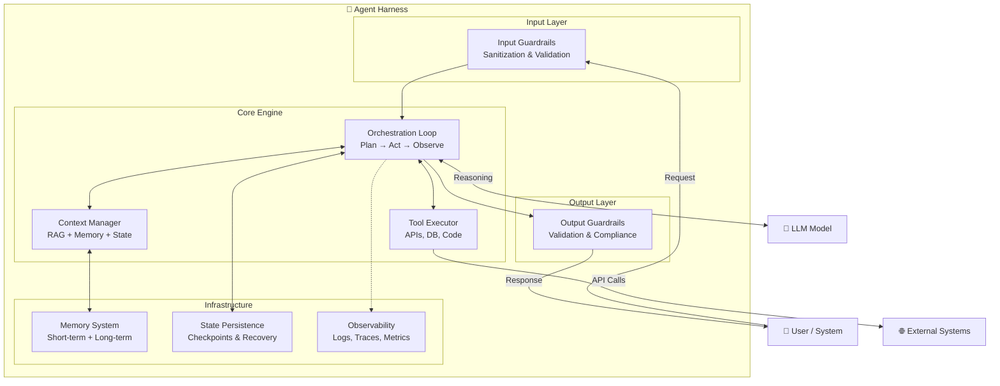
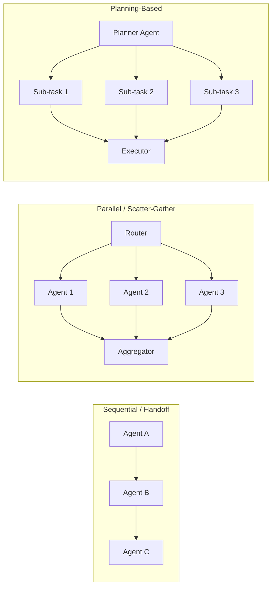

# Agent Harness — Tổng Hợp Kiến Thức

> **Cập nhật:** Tháng 4/2026  
> **Tác giả:** Auto-generated documentation  
> **Phạm vi:** Khái niệm Agent Harness trong AI Engineering & Sản phẩm Harness.io

---

## Mục Lục

1. [Giới Thiệu — Tại Sao "Harness" Lại Quan Trọng?](#1-giới-thiệu--tại-sao-harness-lại-quan-trọng)
2. [Phân Biệt Hai Khái Niệm](#2-phân-biệt-hai-khái-niệm)
3. [Agent Harness — Khái Niệm Kỹ Thuật AI](#3-agent-harness--khái-niệm-kỹ-thuật-ai)
   - 3.1 [Định Nghĩa](#31-định-nghĩa)
   - 3.2 [Quá Trình Tiến Hóa: Prompt → Context → Harness Engineering](#32-quá-trình-tiến-hóa-prompt--context--harness-engineering)
   - 3.3 [Kiến Trúc Agent Harness](#33-kiến-trúc-agent-harness)
   - 3.4 [Các Thành Phần Cốt Lõi](#34-các-thành-phần-cốt-lõi)
   - 3.5 [Mô Hình Orchestration](#35-mô-hình-orchestration)
   - 3.6 [Guardrails — Hệ Thống Rào Chắn](#36-guardrails--hệ-thống-rào-chắn)
   - 3.7 [Memory & State Management](#37-memory--state-management)
   - 3.8 [Best Practices cho Production](#38-best-practices-cho-production)
4. [Harness.io — Sản Phẩm AI Agents cho DevOps](#4-harnessio--sản-phẩm-ai-agents-cho-devops)
   - 4.1 [Tổng Quan Sản Phẩm](#41-tổng-quan-sản-phẩm)
   - 4.2 [Tính Năng Chính](#42-tính-năng-chính)
   - 4.3 [Kiến Trúc Pipeline-Native](#43-kiến-trúc-pipeline-native)
5. [So Sánh với Các Framework Khác](#5-so-sánh-với-các-framework-khác)
6. [Kết Luận & Xu Hướng](#6-kết-luận--xu-hướng)
7. [Tài Liệu Tham Khảo](#7-tài-liệu-tham-khảo)

---

## 1. Giới Thiệu — Tại Sao "Harness" Lại Quan Trọng?

Trong năm 2025–2026, ngành công nghiệp AI đã nhận ra một sự thật quan trọng: **model AI chỉ là "động cơ" — hệ thống bao quanh nó mới là "chiếc xe"**. Dù model có mạnh đến đâu, nếu không có cơ sở hạ tầng phần mềm để điều khiển, giám sát và bảo vệ nó, agent sẽ không thể hoạt động đáng tin cậy trong môi trường production.

Thuật ngữ **"Agent Harness"** (dây cương cho agent) ra đời từ phép ẩn dụ:

> 🐴 Hãy tưởng tượng model AI là một con ngựa đua — mạnh mẽ, nhanh nhẹn nhưng thiếu phương hướng. **Harness** chính là bộ dây cương, yên ngựa và hàm thiếc — thứ biến sức mạnh thô thành công việc có mục đích, đáng tin cậy.

---

## 2. Phân Biệt Hai Khái Niệm

Khi nói về "Harness Agent", cần phân biệt rõ hai khái niệm thường bị nhầm lẫn:

| Đặc điểm | Agent Harness (Khái niệm kỹ thuật) | Harness Agents (Sản phẩm Harness.io) |
|:---|:---|:---|
| **Bản chất** | Nguyên lý thiết kế hệ thống AI | Tính năng sản phẩm cụ thể |
| **Phạm vi** | Bất kỳ AI agent nào | Tự động hóa DevOps/SDLC |
| **Mục tiêu** | Độ tin cậy & an toàn cho agent trong production | Tự động hóa pipeline CI/CD |
| **Giá trị cốt lõi** | Orchestration, guardrails, quản lý trạng thái | Tích hợp pipeline, governance, bảo mật |
| **Đối tượng** | AI/ML Engineers, Platform Engineers | DevOps Engineers, SRE Teams |

---

## 3. Agent Harness — Khái Niệm Kỹ Thuật AI

### 3.1 Định Nghĩa

**Agent Harness** là lớp phần mềm hạ tầng bao quanh model ngôn ngữ lớn (LLM), xử lý **mọi thứ ngoại trừ suy luận cốt lõi**. Nó biến một model stateless (không có trạng thái) thành một hệ thống agent tự chủ, bền vững và đáng tin cậy.

```
┌─────────────────────────────────────────┐
│            AGENT HARNESS                │
│  ┌───────────────────────────────────┐  │
│  │         Guardrails Layer          │  │
│  │  ┌─────────────────────────────┐  │  │
│  │  │    Orchestration Engine     │  │  │
│  │  │  ┌───────────────────────┐  │  │  │
│  │  │  │     LLM / Model       │  │  │  │
│  │  │  │   (Reasoning Core)    │  │  │  │
│  │  │  └───────────────────────┘  │  │  │
│  │  └─────────────────────────────┘  │  │
│  └───────────────────────────────────┘  │
│                                         │
│  ┌──────────┐ ┌──────────┐ ┌─────────┐  │
│  │  Memory  │ │  Tools   │ │  State  │  │
│  │  System  │ │  Layer   │ │ Manager │  │
│  └──────────┘ └──────────┘ └─────────┘  │
│                                         │
│  ┌──────────────────────────────────┐   │
│  │     Observability & Logging     │   │
│  └──────────────────────────────────┘   │
└─────────────────────────────────────────┘
```

### 3.2 Quá Trình Tiến Hóa: Prompt → Context → Harness Engineering

Lĩnh vực AI Engineering đã trải qua ba thế hệ phát triển:

```
2022–2024              2025                    2026
┌──────────┐     ┌──────────────┐     ┌──────────────────┐
│  Prompt  │ ──► │   Context    │ ──► │     Harness      │
│Engineering│     │ Engineering  │     │   Engineering    │
└──────────┘     └──────────────┘     └──────────────────┘
  Tối ưu            Quản lý              Thiết kế
  câu lệnh          ngữ cảnh            kiến trúc hệ thống
```

| Thế hệ | Thời kỳ | Trọng tâm | Mục tiêu |
|:---|:---|:---|:---|
| **Prompt Engineering** | 2022–2024 | Tối ưu hóa câu lệnh/instruction | Lấy output tốt nhất từ một lần gọi model |
| **Context Engineering** | 2025 | Quản lý dữ liệu đầu vào (RAG, memory, lịch sử) | Cung cấp đúng thông tin cần thiết cho model |
| **Harness Engineering** | 2026 | Kiến trúc môi trường vận hành | Đảm bảo độ tin cậy, an toàn và khả năng mở rộng |

#### Tại sao cần bước tiến này?

- **Prompt Engineering** giải quyết: *"Làm sao để model hiểu ý mình?"*
- **Context Engineering** giải quyết: *"Làm sao để model có đủ thông tin?"*
- **Harness Engineering** giải quyết: *"Làm sao để agent hoạt động đáng tin cậy trong production, ngày qua ngày?"*

> **Triết lý cốt lõi:** Mọi lỗi của agent đều là bài toán kiến trúc cần giải quyết bằng thiết kế hệ thống — không phải bằng cách viết lại prompt.

### 3.3 Kiến Trúc Agent Harness



### 3.4 Các Thành Phần Cốt Lõi

#### 3.4.1 Orchestration Loop (Vòng lặp điều phối)

Đây là "nhịp tim" của agent — quản lý chu trình **Suy luận → Hành động → Quan sát**.

```
┌─────────┐     ┌─────────┐     ┌─────────┐
│  Plan   │ ──► │   Act   │ ──► │ Observe │
│ (Lập kế │     │(Thực thi│     │(Quan sát│
│  hoạch) │     │  tool)  │     │ kết quả)│
└─────────┘     └─────────┘     └────┬────┘
     ▲                               │
     └───────────── Loop ─────────────┘
```

**Chức năng chính:**
- Quyết định khi nào cần lập kế hoạch, khi nào dùng tool, khi nào ủy quyền cho sub-agent
- Quản lý luồng thực thi giữa các bước
- Xử lý lỗi và retry logic
- Dừng lại đúng lúc (biết khi nào công việc đã hoàn thành)

#### 3.4.2 Tool Execution Layer (Lớp thực thi công cụ)

Cung cấp giao diện an toàn để agent tương tác với thế giới bên ngoài.

```python
# Ví dụ: Định nghĩa tool với schema rõ ràng
tools = [
    {
        "name": "search_database",
        "description": "Tìm kiếm trong cơ sở dữ liệu khách hàng",
        "parameters": {
            "query": {"type": "string", "required": True},
            "limit": {"type": "integer", "default": 10, "max": 100}
        },
        "permissions": ["db:read"],        # RBAC
        "rate_limit": "10/minute",         # Giới hạn tần suất
        "sandbox": True                    # Chạy trong sandbox
    }
]
```

**Nguyên tắc thiết kế:**
- **Principle of Least Privilege**: Tool chỉ được cấp quyền tối thiểu cần thiết
- **Input/Output Validation**: Validate mọi tham số đầu vào và kết quả đầu ra
- **Sandboxing**: Chạy code execution trong môi trường cách ly
- **Audit Trail**: Ghi log mọi lần gọi tool

#### 3.4.3 Context Manager (Quản lý ngữ cảnh)

Quản lý những gì model "nhìn thấy" tại mỗi bước suy luận.

| Loại context | Nguồn | Chiến lược |
|:---|:---|:---|
| **System prompt** | Cố định | Định nghĩa vai trò, quy tắc, giới hạn |
| **Conversation history** | Tích lũy | Tóm tắt + sliding window |
| **Retrieved knowledge** | RAG pipeline | Vector search + reranking |
| **Task state** | State manager | Trạng thái hiện tại của workflow |
| **Tool results** | Tool executor | Kết quả từ các lần gọi tool trước |

**Kỹ thuật nén context:**
- **Summarization**: Tóm tắt lịch sử hội thoại dài
- **Hierarchical folding**: Gấp các bước đã hoàn thành thành bản tóm tắt
- **Relevance filtering**: Chỉ giữ thông tin liên quan đến bước hiện tại

#### 3.4.4 Observability (Khả năng quan sát)

Trong production, bạn **không thể debug thứ bạn không nhìn thấy**.

```
┌────────────────────────────────────────────────┐
│              Observability Stack                │
├────────────────────────────────────────────────┤
│                                                │
│  📊 Metrics      📝 Logs        🔗 Traces      │
│  ─────────       ──────        ────────        │
│  • Latency       • Prompts     • Request ID    │
│  • Token usage   • Responses   • Tool chain    │
│  • Error rate    • Tool calls  • Decision tree │
│  • Cost/request  • Guardrail   • Parent-child  │
│                    triggers      spans          │
│                                                │
│  🧪 Evaluations                                │
│  ──────────────                                │
│  • Quality scores   • Regression tests         │
│  • Hallucination    • Production replays       │
│    detection                                   │
└────────────────────────────────────────────────┘
```

### 3.5 Mô Hình Orchestration

Có hai hướng tiếp cận chính cho orchestration:

#### LLM-Driven (Model quyết định)

Model tự quyết định tool nào cần sử dụng và thứ tự thực hiện.

```
User Request → LLM → "Tôi cần gọi tool A" → Execute A → LLM → "Kết quả OK" → Response
```

**Ưu điểm:** Linh hoạt, thích ứng với tình huống mới  
**Nhược điểm:** Khó dự đoán, có thể đi lạc hướng

#### Code-Driven (Mã nguồn quyết định)

Luồng xử lý được định nghĩa trước bằng state machine hoặc graph.

```
User Request → State Machine → Step 1 (deterministic) → LLM → Step 2 → ... → Response
```

**Ưu điểm:** Dự đoán được, dễ test, dễ debug  
**Nhược điểm:** Ít linh hoạt, cần thiết kế trước

#### Các Pattern Orchestration phổ biến



| Pattern | Khi nào sử dụng | Ví dụ |
|:---|:---|:---|
| **Sequential** | Các bước phụ thuộc lẫn nhau | Pipeline xử lý dữ liệu ETL |
| **Parallel** | Các task độc lập | Tìm kiếm đồng thời trên nhiều nguồn |
| **Planning** | Task phức tạp, nhiều bước | Research agent, coding agent |
| **Hierarchical** | Tổ chức team agent | Manager → Worker agents |

### 3.6 Guardrails — Hệ Thống Rào Chắn

Guardrails là các ràng buộc kỹ thuật và quy trình bắt buộc, định nghĩa "phạm vi ảnh hưởng" (blast radius) của agent.

#### Ba Lớp Guardrails

```
Request ──► [INPUT GUARDRAILS] ──► [IN-PROCESS GUARDRAILS] ──► [OUTPUT GUARDRAILS] ──► Response
                  │                        │                          │
                  ▼                        ▼                          ▼
            • Anti-injection         • Format rules              • Hallucination
            • PII detection          • API restrictions            detection
            • Rate limiting          • Cost limits               • Toxicity filter
            • Auth validation        • Timeout enforcement       • Compliance check
```

**Nguyên tắc vàng:**

> ⚠️ **Không bao giờ dựa vào LLM làm ranh giới quyết định cho hành động có rủi ro cao.** Hãy dùng logic code cứng (deterministic).

**Ví dụ thực tế:**

```python
# ❌ SAI: Dựa vào LLM để kiểm tra quyền
prompt = "Kiểm tra xem user này có quyền xóa database không?"

# ✅ ĐÚNG: Dùng code cứng
def execute_tool(tool_name, user, params):
    # Deterministic permission check
    if tool_name == "delete_database":
        if not user.has_permission("admin:delete"):
            raise PermissionError("Unauthorized")
        if not params.get("confirmation_token"):
            raise ValueError("Confirmation required")
    
    # Chỉ sau khi pass tất cả check mới cho agent thực thi
    return agent.execute(tool_name, params)
```

### 3.7 Memory & State Management

LLM vốn là stateless — chúng không "nhớ" gì giữa các lần gọi. Harness phải bổ sung khả năng bộ nhớ.

#### Phân loại Memory

```
┌──────────────────────────────────────────────────────┐
│                   MEMORY SYSTEM                       │
├──────────────────┬──────────────────┬────────────────┤
│  Working Memory  │ Episodic Memory  │ Semantic Memory│
│  (Bộ nhớ làm     │ (Bộ nhớ sự       │ (Bộ nhớ tri    │
│   việc)          │  kiện)           │  thức)         │
├──────────────────┼──────────────────┼────────────────┤
│ • Context window │ • Lịch sử task   │ • Knowledge    │
│ • Current plan   │ • Kết quả cũ     │   base         │
│ • Tool results   │ • Lessons learned│ • User prefs   │
│   gần đây        │ • Error patterns │ • Domain rules │
├──────────────────┼──────────────────┼────────────────┤
│ Trong 1 session  │ Xuyên sessions   │ Vĩnh viễn      │
│ Nhanh, có giới   │ Vector DB +      │ Structured DB  │
│ hạn kích thước   │ Summarization    │ + Retrieval    │
└──────────────────┴──────────────────┴────────────────┘
```

#### State Persistence cho Workflow dài

Đối với các workflow kéo dài (nhiều giờ, nhiều ngày), state persistence là bắt buộc:

```python
# Ví dụ: Checkpoint pattern với LangGraph
from langgraph.checkpoint import MemorySaver

checkpointer = MemorySaver()

# Agent có thể dừng lại chờ human approval
# rồi tiếp tục chính xác tại điểm đã dừng
graph = build_agent_graph()
config = {"configurable": {"thread_id": "task-123"}}

# Bước 1: Agent thực thi đến điểm cần approval
result = graph.invoke(input_data, config)

# ... Sau nhiều giờ, human approve ...

# Bước 2: Tiếp tục từ checkpoint
result = graph.invoke(Command(resume=approval_data), config)
```

**Công nghệ phổ biến:**
- **Temporal**: Durable execution, agent có thể sống sót qua server restart
- **LangGraph Checkpoints**: State persistence cho stateful workflows
- **Redis**: Working memory nhanh cho session data
- **Vector DB (Pinecone, Weaviate)**: Long-term semantic memory

### 3.8 Best Practices cho Production

#### 1. Determinism trước, Flexibility sau

```
Khi agent đạt được mục tiêu → Trả quyền điều khiển về code thông thường NGAY LẬP TỨC
```

Chỉ dùng LLM cho phần cần suy luận. Phần còn lại dùng code cứng.

#### 2. Zero-Trust Security

- Mọi agent là **Non-Human Identity (NHI)** với quyền hạn được giới hạn nghiêm ngặt
- RBAC (Role-Based Access Control) bắt buộc
- Input validation + Output sanitization trên mọi tool call
- Secrets management — không bao giờ hardcode credentials

#### 3. Observability là Bắt Buộc

```
Không thể debug → Không thể sửa → Không thể tin tưởng → Không thể deploy
```

Triển khai "debugger cho suy nghĩ AI" — trace tại sao agent chọn hành động X thay vì Y.

#### 4. Human-in-the-Loop

Với các quyết định quan trọng, luôn có **approval gate**:

```
Agent đề xuất thay đổi → Human review → Approve/Reject → Agent tiếp tục/dừng
```

Mục tiêu là **"human-directed autonomy"** — con người chỉ đạo, AI tự chủ trong phạm vi cho phép.

#### 5. Continuous Evaluation (Đánh giá liên tục)

- **Benchmark tĩnh** không đủ cho production
- Sử dụng **Production Replays**: test agent với dữ liệu thật từ production logs
- **Shadow Deployment**: chạy phiên bản mới song song với phiên bản hiện tại, so sánh kết quả
- **Golden Dataset**: tập test cases chuẩn để phát hiện regression

#### 6. Graceful Degradation

```
Primary Agent fails → Fallback to simpler model → Fallback to cached response → Human escalation
```

---

## 4. Harness.io — Sản Phẩm AI Agents cho DevOps

### 4.1 Tổng Quan Sản Phẩm

**Harness.io** là nền tảng phân phối phần mềm (Software Delivery Platform) đã tích hợp AI agents vào core product. Quá trình phát triển:

```
AIDA (AI Dev Assistant)  ──►  Harness AI  ──►  Harness Agents
     2024                       2025             2026
   Chatbot trợ giúp        AI tích hợp       Agent tự chủ
                           vào platform      trong pipeline
```

**Điểm khác biệt cốt lõi:** Harness Agents không phải chatbot AI thông thường — chúng là **worker tự chủ, chạy trực tiếp trong pipeline** (pipeline-native).

### 4.2 Tính Năng Chính

#### 4.2.1 Pipeline Automation

| Tính năng | Mô tả |
|:---|:---|
| **Natural Language Pipeline Generation** | Mô tả pipeline bằng ngôn ngữ tự nhiên → Tự động sinh YAML |
| **Autonomous Workflows** | Provisioning infra (Terraform/IaC), deploy, release tự động |
| **YAML Auto-Repair** | Tự động sửa lỗi pipeline YAML khi có failure |

#### 4.2.2 Troubleshooting & Remediation

| Tính năng | Mô tả |
|:---|:---|
| **AI-Powered Root Cause Analysis** | Scan logs, tương quan lỗi, đề xuất fix cụ thể |
| **Agentic Error Analyzer** | Phân tích pipeline failure tự động, nhiều bước |
| **Self-healing Pipelines** | Phát hiện và sửa các lỗi pattern phổ biến |

#### 4.2.3 Governance, Security & Compliance

| Tính năng | Mô tả |
|:---|:---|
| **OPA Policy Generation** | Tự động tạo Rego policies cho compliance |
| **Vulnerability Remediation** | Phát hiện CVE/CWE + đề xuất fix tự động |
| **Cloud Governance** | Policies cho quản lý cloud assets + cost optimization |

#### 4.2.4 Developer Experience

| Tính năng | Mô tả |
|:---|:---|
| **Code Explanation** | Giải thích code trong context pipeline |
| **Test Case Generation** | Tự động sinh test cases để tăng coverage |
| **Automated Code Review** | Đề xuất review thông minh, context-aware |

### 4.3 Kiến Trúc Pipeline-Native

Đây là kiến trúc phân biệt Harness Agents với các AI chatbot thông thường:

```
┌──────────────────────────────────────────────────────┐
│                  HARNESS PIPELINE                     │
├──────────────────────────────────────────────────────┤
│                                                      │
│  Stage 1: Build                                      │
│  ┌─────────┐  ┌─────────┐  ┌──────────────────────┐ │
│  │  Step 1  │→│  Step 2  │→│  🤖 AI Agent Step    │ │
│  │ Compile  │  │  Test   │  │  ──────────────────  │ │
│  │          │  │         │  │  • Inherits RBAC     │ │
│  │          │  │         │  │  • Uses Secrets      │ │
│  │          │  │         │  │  • Follows policies  │ │
│  │          │  │         │  │  • Has full context  │ │
│  └─────────┘  └─────────┘  └──────────────────────┘ │
│                                                      │
│  Stage 2: Deploy                                     │
│  ┌──────────────────────┐  ┌─────────┐              │
│  │  🤖 DevOps Agent     │→│  Step 2  │              │
│  │  ──────────────────  │  │ Verify  │              │
│  │  Context: Knowledge  │  │         │              │
│  │  Graph (services,    │  │         │              │
│  │  incidents, infra)   │  │         │              │
│  └──────────────────────┘  └─────────┘              │
│                                                      │
├──────────────────────────────────────────────────────┤
│  Governance Layer: OPA Policies + RBAC + Audit Log   │
└──────────────────────────────────────────────────────┘
```

**Đặc điểm Pipeline-Native:**

1. **Kế thừa Context** — Agent tự động có access vào context pipeline: biến môi trường, kết quả các bước trước, metadata service
2. **Kế thừa Permissions** — Agent tuân theo RBAC đã được thiết lập, không cần cấu hình riêng
3. **Kế thừa Secrets** — Agent truy cập secrets thông qua Secrets Manager của pipeline, không expose credentials
4. **Kế thừa Governance** — Mọi hành động của agent đều qua OPA policy evaluation

**Software Delivery Knowledge Graph:**

Harness sử dụng Knowledge Graph để cung cấp context cho agent:

```
        ┌─────────┐
        │ People  │
        └────┬────┘
             │
    ┌────────┼────────┐
    ▼        ▼        ▼
┌───────┐ ┌──────┐ ┌──────────┐
│Service│ │Infra │ │Incidents │
└───┬───┘ └──┬───┘ └────┬─────┘
    │        │          │
    ▼        ▼          ▼
┌───────┐ ┌──────┐ ┌──────────┐
│Pipelin│ │Enviro│ │Change    │
│  es   │ │nments│ │ History  │
└───────┘ └──────┘ └──────────┘
```

Agent không chỉ "đoán" — nó quyết định dựa trên **trạng thái thực tế, real-time** của hệ thống.

**System Agents vs Custom Agents:**

| Loại | Mô tả | Ví dụ |
|:---|:---|:---|
| **System Agents** | Agent dựng sẵn bởi Harness | Error Analyzer, Pipeline Generator |
| **Custom Agents** | Tự tạo bằng templates | Agent kiểm tra compliance nội bộ |

Custom Agents có thể:
- Version control
- Chia sẻ giữa các team
- Template hóa để tái sử dụng

---

## 5. So Sánh với Các Framework Khác

### Agent Harness Frameworks (2026)

| Framework | Điểm mạnh | Phù hợp cho | Harness Engineering Score |
|:---|:---|:---|:---|
| **LangGraph** | Stateful workflows, cycles, time-travel debug | Complex, long-running agents | ⭐⭐⭐⭐⭐ |
| **CrewAI** | Role-based agent teams, dễ setup | Multi-agent collaboration | ⭐⭐⭐⭐ |
| **AutoGen / AG2** | Multi-agent conversation, research | Research & exploration | ⭐⭐⭐⭐ |
| **MS Agent Framework** | Enterprise-grade, Semantic Kernel | Production enterprise apps | ⭐⭐⭐⭐⭐ |
| **Temporal + LLM** | Durable execution, fault tolerance | Mission-critical workflows | ⭐⭐⭐⭐⭐ |
| **Harness.io Agents** | Pipeline-native, DevOps-specific | CI/CD, SDLC automation | ⭐⭐⭐⭐⭐ (for DevOps) |

### Khi nào chọn gì?

```
Câu hỏi: "Tôi cần làm gì?"
│
├── Tự động hóa DevOps pipeline?
│   └── → Harness.io Agents
│
├── Xây agent phức tạp, nhiều bước, cần state?
│   └── → LangGraph + Temporal
│
├── Cần team nhiều agent phối hợp?
│   ├── Role-based → CrewAI
│   └── Conversation-based → AutoGen
│
├── Enterprise app cần production-grade reliability?
│   └── → Microsoft Agent Framework
│
└── Custom agent infrastructure từ đầu?
    └── → Tự xây harness + LLM API
```

---

## 6. Kết Luận & Xu Hướng

### Các Xu Hướng Chính (2026)

1. **Agent as Infrastructure** — Agent không còn là tính năng phụ, mà trở thành hạ tầng cốt lõi
2. **Harness > Model** — Lợi thế cạnh tranh nằm ở harness, không phải model (model đang bị commodity hóa)
3. **Cognitive DevOps** — Tự động hóa thông minh toàn bộ SDLC, không chỉ code generation
4. **Human-Aware Agents** — Agent biết khi nào cần hỏi ý kiến con người, khi nào tự quyết
5. **Evaluation-Driven Development** — Phát triển agent dựa trên evaluation metrics, không phải "cảm giác"

### Takeaways Quan Trọng

> **Đối với AI Engineers:**
> - Đầu tư vào harness engineering quan trọng hơn prompt engineering
> - Xây hệ thống khiến agent *không thể* mắc lỗi, thay vì *bảo* nó đừng mắc lỗi
> - Observability không phải nice-to-have, mà là must-have

> **Đối với DevOps Engineers:**
> - Harness.io Agents là bước tiến từ chatbot AI sang worker tự chủ trong pipeline
> - Pipeline-native approach giải quyết vấn đề governance và security mà generic AI tools không làm được
> - Bắt đầu với System Agents, sau đó mở rộng sang Custom Agents

> **Đối với Tech Leaders:**
> - Model AI là commodity — "chiếc xe" (harness) quan trọng hơn "động cơ" (model)
> - ROI thực sự đến từ tự động hóa quy trình *sau khi* code được viết
> - Governance-first approach là bắt buộc, không phải tùy chọn

---

## 7. Tài Liệu Tham Khảo

### Agent Harness — Khái niệm

- [NXCode — Agent Harness Engineering](https://nxcode.io) — Giải thích chi tiết về khái niệm harness engineering
- [Epsilla — From Prompt to Harness Engineering](https://epsilla.com) — Quá trình tiến hóa từ prompt đến harness engineering
- [Medium — The Car vs The Engine: Agent Harness](https://medium.com) — Phép ẩn dụ "chiếc xe vs động cơ"
- [DailyDoseOfDS — Agent Harness Components](https://dailydoseofds.com) — Phân tích các thành phần cốt lõi

### Harness.io — Sản phẩm

- [Harness.io Official — AI Agents Documentation](https://harness.io) — Tài liệu chính thức về Harness Agents
- [SiliconAngle — Harness AI Agents Coverage](https://siliconangle.com) — Bài viết phân tích từ SiliconAngle
- [PRNewswire — Harness AI Announcements](https://prnewswire.com) — Thông cáo báo chí về các tính năng mới

### Frameworks & Tools

- [LangGraph Documentation](https://langchain.com) — Framework cho stateful agent workflows
- [Temporal.io](https://temporal.io) — Durable execution cho long-running agents
- [OpenAI — Agent Best Practices](https://openai.com) — Hướng dẫn chính thức từ OpenAI

### Guardrails & Security

- [Agno — Guardrails for AI Agents](https://agno.com) — Framework guardrails
- [Aembit — Non-Human Identity & Agent Security](https://aembit.io) — Bảo mật cho AI agents

---

> 📝 **Ghi chú:** Tài liệu này được tổng hợp từ nhiều nguồn tính đến tháng 4/2026. Lĩnh vực AI agent phát triển rất nhanh — hãy kiểm tra các nguồn gốc để cập nhật thông tin mới nhất.
