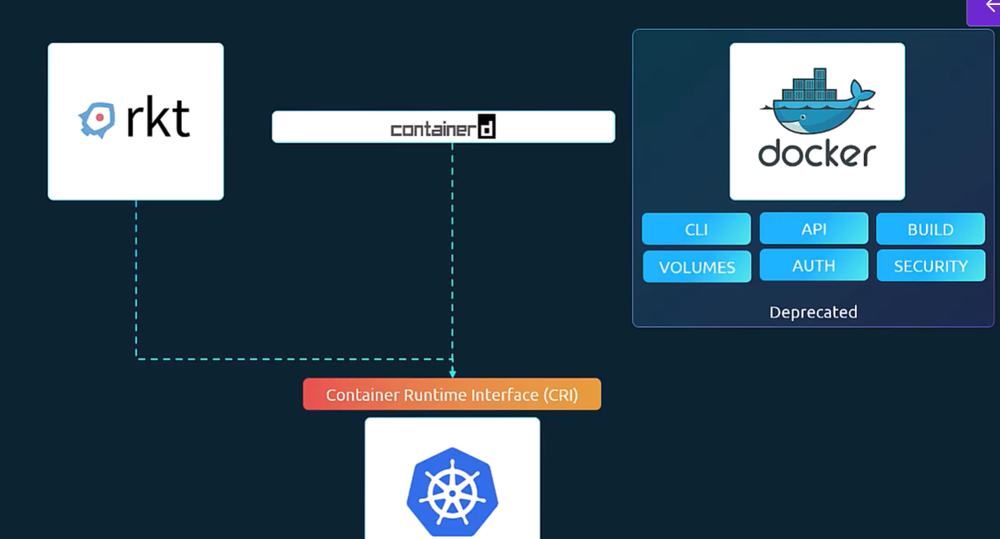
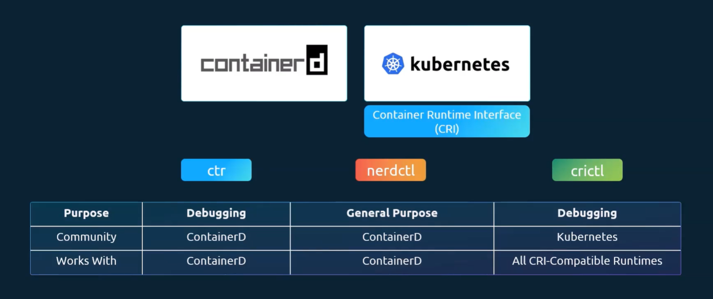

k8s support CRI which support any vendor to work as container runtime (RKT,..) as long as it adheres to the OCI standard. Docker doesn't implement CRI natively, so Kubernetes used a special translation layer called `dockershim` that converted CRI calls to Docker API calls. This allowed Docker to work with Kubernetes, but dockershim was removed in v1.24.

**containerd** is CRI compatible and can work directly with k8s as all other runtimes so containerd can be used as runtime separate from docker.

**From v1.24** the k8s removed docker support.

Docker là một **nền tảng container toàn diện**(bao gồm CLI, API, build, registry, runtime), trong khi **containerd&#x20;**&#x63;hỉ là một **container runtime nhẹ&#x20;**&#x63;huyên quản lý vòng đời container. Nói cách khác, Docker dùng containerd bên dưới, nhưng containerd có thể chạy độc lập trong Kubernetes hoặc các hệ thống khác

| Tiêu chí                   | Docker                                                                                  | containerd                                                                       |
| -------------------------- | --------------------------------------------------------------------------------------- | -------------------------------------------------------------------------------- |
| **Bản chất**               | Nền tảng container hóa đầy đủ                                                           | Runtime nhẹ, tập trung vào quản lý container                                     |
| **Thành phần**             | Docker CLI, Docker API, Docker Daemon, Build, Registry, Networking                      | Quản lý image, container lifecycle, storage, network                             |
| **Mức độ trừu tượng**      | Cao – cung cấp trải nghiệm developer-friendly                                           | Thấp – chỉ lo việc chạy và quản lý container                                     |
| **Quan hệ với Kubernetes** | Trước đây Kubernetes dùng Docker trực tiếp, nhưng nay chuyển sang containerd (theo CRI) | Được Kubernetes hỗ trợ trực tiếp qua CRI (Container Runtime Interface)           |
| **Use case**               | Dành cho developer: build, push, run container dễ dàng                                  | Dành cho hệ thống: runtime hiệu quả, tích hợp với Kubernetes, cloud-native stack |
| **Hiệu năng**              | Nặng hơn vì nhiều thành phần                                                            | Nhẹ hơn, tối ưu cho runtime                                                      |

**Nerdctl là một CLI tương thích Docker nhưng chạy trực tiếp trên containerd, trong khi Docker là một nền tảng container toàn diện với daemon riêng.** Nói ngắn gọn: Docker = full stack (daemon + CLI + build + registry), còn nerdctl = CLI nhẹ, không cần Docker daemon, dùng containerd làm runtime.

### 🔑 So sánh chi tiết nerdctl vs Docker

| Tiêu chí                | Docker                                                                  | nerdctl                                                                                       |
| ----------------------- | ----------------------------------------------------------------------- | --------------------------------------------------------------------------------------------- |
| **Kiến trúc**           | Dựa trên **Docker daemon**(dockerd) chạy nền, quản lý container qua API | Chạy trực tiếp trên **containerd**(runtime chuẩn của Kubernetes), không cần daemon riêng      |
| **CLI**                 | `docker run`, `docker build`, `docker ps`…                              | Cú pháp **tương thích Docker**(`nerdctl run`, `nerdctl build`…), dễ chuyển đổi                |
| **Tích hợp**            | Docker Compose, Docker Desktop, Docker Hub                              | Hỗ trợ **Compose**, **BuildKit**, **CNI networking**, OCI images, tích hợp tốt với Kubernetes |
| **Phụ thuộc**           | Cần Docker daemon (root privileges, single point of failure)            | Không cần Docker daemon, tận dụng containerd vốn đã có trong Kubernetes                       |
| **Use case**            | Phù hợp cho developer, môi trường dev/test, CI/CD                       | Phù hợp cho môi trường **cloud-native**, Kubernetes cluster, nơi containerd đã là runtime     |
| **Hiệu năng & bảo mật** | Nặng hơn, có thêm lớp daemon                                            | Nhẹ hơn, ít overhead, giảm rủi ro bảo mật từ daemon                                           |

`crictl` là một công cụ CLI (Command Line Interface) dành cho **Container Runtime Interface (CRI)** trong Kubernetes. Nó khác với `docker` hay `nerdctl` ở chỗ: thay vì dành cho developer hoặc quản lý container trực tiếp, `crictl` được thiết kế để **debug và quản lý container runtime trong cluster Kubernetes**.

ctr, nerdctl, crictl thường dùng cho debug container runtime trong môi trường Kubernetes, trong khi docker thường dùng trong phát triển ứng dụng container.