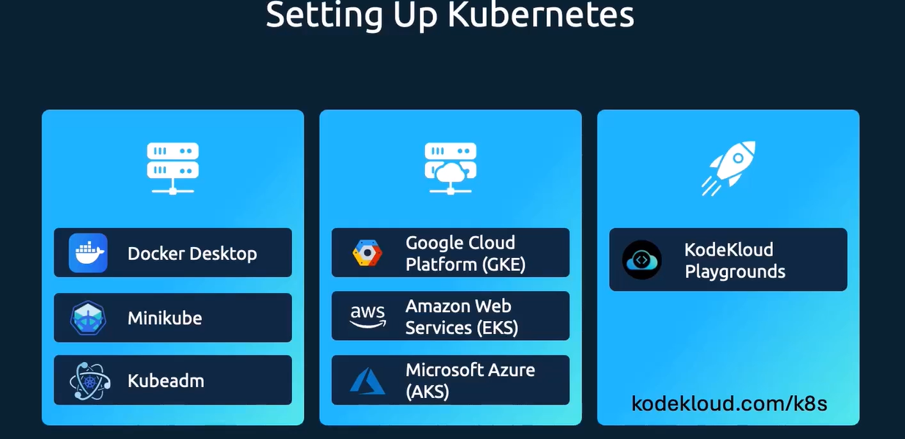

# Update và Rolling Updates trong Kubernetes

## 1. Tổng quan về Update Strategy

Kubernetes Deployment hỗ trợ 2 loại update strategy:

### 1.1. RollingUpdate (Mặc định)
- **Cách hoạt động**: Thay thế từng pod cũ bằng pod mới một cách tuần tự
- **Ưu điểm**: Zero downtime, service luôn available
- **Nhược điểm**: Có thể có 2 version chạy cùng lúc trong quá trình update

### 1.2. Recreate
- **Cách hoạt động**: Terminate tất cả pods cũ trước, sau đó tạo pods mới
- **Ưu điểm**: Đơn giản, không có version conflict
- **Nhược điểm**: Có downtime trong quá trình update

## 2. Cấu hình RollingUpdate

### 2.1. Các tham số quan trọng

```yaml
spec:
  strategy:
    type: RollingUpdate
    rollingUpdate:
      maxSurge: 1          # Số pods có thể tạo thêm trên desired replicas
      maxUnavailable: 0    # Số pods có thể unavailable trong quá trình update
```

**Giải thích:**
- **maxSurge**: 
  - Giá trị tuyệt đối (ví dụ: `1`) hoặc phần trăm (ví dụ: `25%`)
  - Cho phép tạo thêm pods để đảm bảo capacity trong quá trình update
  - Ví dụ: `replicas: 3`, `maxSurge: 1` → có thể có tối đa 4 pods (3 desired + 1 new)

- **maxUnavailable**:
  - Giá trị tuyệt đối (ví dụ: `0`) hoặc phần trăm (ví dụ: `25%`)
  - Số pods có thể unavailable trong quá trình update
  - `0` = zero downtime (luôn có đủ pods phục vụ traffic)
  - `1` = cho phép 1 pod unavailable (nhanh hơn nhưng có thể có downtime ngắn)

### 2.2. Ví dụ cấu hình

**Zero Downtime (Khuyến nghị cho Production):**
```yaml
strategy:
  type: RollingUpdate
  rollingUpdate:
    maxSurge: 1
    maxUnavailable: 0
```

**Fast Update (Chấp nhận downtime ngắn):**
```yaml
strategy:
  type: RollingUpdate
  rollingUpdate:
    maxSurge: 2
    maxUnavailable: 1
```

**Conservative Update (An toàn nhất):**
```yaml
strategy:
  type: RollingUpdate
  rollingUpdate:
    maxSurge: 1
    maxUnavailable: 0
```

## 3. Cách thực hiện Update

### 3.1. Update bằng kubectl set image

```bash
# Update image của deployment
kubectl set image deployment/bottleneck-resolve \
  bottleneck-resolve=bottleneck-resolve:v2 \
  -n bottleneck-resolve

# Xem trạng thái rollout
kubectl rollout status deployment/bottleneck-resolve -n bottleneck-resolve
```

### 3.2. Update bằng cách edit manifest

```bash
# Edit deployment trực tiếp
kubectl edit deployment bottleneck-resolve -n bottleneck-resolve

# Hoặc apply file YAML đã chỉnh sửa
kubectl apply -f deploy/04-deployment.yaml
```

### 3.3. Update bằng cách patch

```bash
# Patch image
kubectl patch deployment bottleneck-resolve \
  -n bottleneck-resolve \
  -p '{"spec":{"template":{"spec":{"containers":[{"name":"bottleneck-resolve","image":"bottleneck-resolve:v2"}]}}}}'
```

## 4. Rollback (Hoàn nguyên)

### 4.1. Xem lịch sử rollout

```bash
# Xem tất cả revisions
kubectl rollout history deployment/bottleneck-resolve -n bottleneck-resolve

# Xem chi tiết một revision cụ thể
kubectl rollout history deployment/bottleneck-resolve --revision=2 -n bottleneck-resolve
```

### 4.2. Rollback về version trước

```bash
# Rollback về revision trước đó
kubectl rollout undo deployment/bottleneck-resolve -n bottleneck-resolve

# Rollback về một revision cụ thể
kubectl rollout undo deployment/bottleneck-resolve --to-revision=1 -n bottleneck-resolve
```

### 4.3. Xem trạng thái rollback

```bash
# Xem trạng thái rollback
kubectl rollout status deployment/bottleneck-resolve -n bottleneck-resolve
```

## 5. Thực hành: Test Rolling Updates và Rollback

### 5.1. Chuẩn bị môi trường

Tạo một deployment đơn giản để test:

```bash
# Tạo namespace
kubectl create namespace rolling-test

# Tạo deployment với version v1
cat <<EOF | kubectl apply -f -
apiVersion: apps/v1
kind: Deployment
metadata:
  name: rolling-test
  namespace: rolling-test
spec:
  replicas: 3
  strategy:
    type: RollingUpdate
    rollingUpdate:
      maxSurge: 1
      maxUnavailable: 0
  selector:
    matchLabels:
      app: rolling-test
  template:
    metadata:
      labels:
        app: rolling-test
        version: v1
    spec:
      containers:
      - name: nginx
        image: nginx:1.21
        ports:
        - containerPort: 80
        env:
        - name: VERSION
          value: "v1"
EOF
```

### 5.2. Test Rolling Update

**Bước 1: Kiểm tra trạng thái ban đầu**

```bash
# Xem pods
kubectl get pods -n rolling-test -l app=rolling-test -w

# Xem deployment
kubectl get deployment rolling-test -n rolling-test

# Xem chi tiết pods
kubectl describe pods -n rolling-test -l app=rolling-test
```

**Bước 2: Thực hiện update**

```bash
# Update image từ nginx:1.21 sang nginx:1.22
kubectl set image deployment/rolling-test \
  nginx=nginx:1.22 \
  -n rolling-test

# Hoặc update bằng cách thay đổi environment variable
kubectl set env deployment/rolling-test \
  VERSION=v2 \
  -n rolling-test
```

**Bước 3: Quan sát quá trình rolling update**

```bash
# Terminal 1: Watch pods
kubectl get pods -n rolling-test -w

# Terminal 2: Watch deployment
kubectl get deployment rolling-test -n rolling-test -w

# Terminal 3: Xem rollout status
kubectl rollout status deployment/rolling-test -n rolling-test
```

**Bước 4: Kiểm tra kết quả**

```bash
# Xem pods mới
kubectl get pods -n rolling-test -o wide

# Xem image của pods
kubectl get pods -n rolling-test -o jsonpath='{range .items[*]}{.metadata.name}{"\t"}{.spec.containers[0].image}{"\n"}{end}'

# Xem revision history
kubectl rollout history deployment/rolling-test -n rolling-test
```

### 5.3. Test Rollback

**Bước 1: Xem lịch sử revisions**

```bash
# Xem tất cả revisions
kubectl rollout history deployment/rolling-test -n rolling-test

# Xem chi tiết revision cụ thể
kubectl rollout history deployment/rolling-test --revision=1 -n rolling-test
kubectl rollout history deployment/rolling-test --revision=2 -n rolling-test
```

**Bước 2: Thực hiện rollback**

```bash
# Rollback về revision trước
kubectl rollout undo deployment/rolling-test -n rolling-test

# Hoặc rollback về revision cụ thể
kubectl rollout undo deployment/rolling-test --to-revision=1 -n rolling-test
```

**Bước 3: Quan sát quá trình rollback**

```bash
# Watch rollout status
kubectl rollout status deployment/rolling-test -n rolling-test

# Watch pods
kubectl get pods -n rolling-test -w
```

**Bước 4: Xác nhận rollback thành công**

```bash
# Kiểm tra image đã rollback
kubectl get pods -n rolling-test -o jsonpath='{range .items[*]}{.metadata.name}{"\t"}{.spec.containers[0].image}{"\n"}{end}'

# Kiểm tra environment variable
kubectl get pods -n rolling-test -o jsonpath='{range .items[*]}{.metadata.name}{"\t"}{.spec.containers[0].env[?(@.name=="VERSION")].value}{"\n"}{end}'
```

### 5.4. Test với Service (Kiểm tra Zero Downtime)

**Bước 1: Tạo Service**

```bash
cat <<EOF | kubectl apply -f -
apiVersion: v1
kind: Service
metadata:
  name: rolling-test-service
  namespace: rolling-test
spec:
  selector:
    app: rolling-test
  ports:
  - port: 80
    targetPort: 80
  type: ClusterIP
EOF
```

**Bước 2: Tạo script test continuous requests**

```bash
# Tạo script test
cat > /tmp/test-continuous.sh <<'SCRIPT'
#!/bin/bash
while true; do
  kubectl run -it --rm test-pod --image=curlimages/curl --restart=Never \
    -- curl -s http://rolling-test-service.rolling-test.svc.cluster.local/ \
    | grep -o "nginx/[0-9.]*" || echo "ERROR"
  sleep 1
done
SCRIPT

chmod +x /tmp/test-continuous.sh
```

**Bước 3: Chạy test trong khi update**

```bash
# Terminal 1: Chạy continuous requests
/tmp/test-continuous.sh

# Terminal 2: Thực hiện update
kubectl set image deployment/rolling-test nginx=nginx:1.23 -n rolling-test

# Quan sát: Requests không bị gián đoạn (zero downtime)
```

### 5.5. Test các kịch bản khác

**Test với maxUnavailable > 0:**

```bash
# Update deployment với maxUnavailable: 1
kubectl patch deployment rolling-test -n rolling-test \
  -p '{"spec":{"strategy":{"rollingUpdate":{"maxUnavailable":1}}}}'

# Thực hiện update và quan sát
kubectl set image deployment/rolling-test nginx=nginx:1.24 -n rolling-test
kubectl get pods -n rolling-test -w
```

**Test với Recreate strategy:**

```bash
# Thay đổi strategy sang Recreate
kubectl patch deployment rolling-test -n rolling-test \
  -p '{"spec":{"strategy":{"type":"Recreate"}}}'

# Thực hiện update
kubectl set image deployment/rolling-test nginx=nginx:1.25 -n rolling-test

# Quan sát: Tất cả pods cũ bị terminate trước, sau đó tạo pods mới
kubectl get pods -n rolling-test -w
```

**Test pause và resume rollout:**

```bash
# Pause rollout
kubectl rollout pause deployment/rolling-test -n rolling-test

# Thực hiện nhiều thay đổi
kubectl set image deployment/rolling-test nginx=nginx:1.26 -n rolling-test
kubectl set env deployment/rolling-test VERSION=v3 -n rolling-test

# Resume rollout (tất cả thay đổi sẽ được apply cùng lúc)
kubectl rollout resume deployment/rolling-test -n rolling-test
```

## 6. Best Practices

### 6.1. Cấu hình RollingUpdate cho Production

```yaml
strategy:
  type: RollingUpdate
  rollingUpdate:
    maxSurge: 1              # Tạo thêm 1 pod để đảm bảo capacity
    maxUnavailable: 0        # Zero downtime
```

### 6.2. Sử dụng Readiness Probe

```yaml
readinessProbe:
  httpGet:
    path: /actuator/health/readiness
    port: 8080
  initialDelaySeconds: 30
  periodSeconds: 5
  timeoutSeconds: 3
  failureThreshold: 3
```

**Lý do**: Đảm bảo pod mới chỉ nhận traffic khi đã sẵn sàng.

### 6.3. Sử dụng Labels và Annotations để track version

```yaml
metadata:
  labels:
    app: bottleneck-resolve
    version: v2
  annotations:
    deployment.kubernetes.io/revision: "2"
    image.tag: "v2.0.0"
```

### 6.4. Giữ lại rollout history

```bash
# Mặc định Kubernetes giữ 10 revisions
# Có thể cấu hình trong deployment:
spec:
  revisionHistoryLimit: 5  # Giữ lại 5 revisions
```

### 6.5. Monitor rollout progress

```bash
# Sử dụng kubectl rollout status
kubectl rollout status deployment/bottleneck-resolve -n bottleneck-resolve

# Hoặc watch pods
kubectl get pods -l app=bottleneck-resolve -w
```

## 7. Troubleshooting

### 7.1. Rollout bị stuck

```bash
# Xem chi tiết deployment
kubectl describe deployment rolling-test -n rolling-test

# Xem events
kubectl get events -n rolling-test --sort-by='.lastTimestamp'

# Xem logs của pods
kubectl logs -l app=rolling-test -n rolling-test
```

### 7.2. Rollout failed

```bash
# Xem rollout status
kubectl rollout status deployment/rolling-test -n rolling-test

# Xem failed pods
kubectl get pods -n rolling-test | grep -i error

# Xem logs của failed pods
kubectl logs <pod-name> -n rolling-test
```

### 7.3. Force rollback khi stuck

```bash
# Nếu rollout bị stuck, có thể force rollback
kubectl rollout undo deployment/rolling-test -n rolling-test

# Hoặc scale down rồi scale up lại
kubectl scale deployment rolling-test --replicas=0 -n rolling-test
kubectl scale deployment rolling-test --replicas=3 -n rolling-test
```

## 8. Cleanup

Sau khi test xong, cleanup resources:

```bash
# Xóa namespace (sẽ xóa tất cả resources trong namespace)
kubectl delete namespace rolling-test

# Hoặc xóa từng resource
kubectl delete deployment rolling-test -n rolling-test
kubectl delete service rolling-test-service -n rolling-test
```

## 9. Tóm tắt

- **RollingUpdate**: Thay thế pods từng cái một, đảm bảo zero downtime
- **maxSurge**: Số pods có thể tạo thêm trong quá trình update
- **maxUnavailable**: Số pods có thể unavailable (0 = zero downtime)
- **Rollback**: Sử dụng `kubectl rollout undo` để quay về version trước
- **History**: Sử dụng `kubectl rollout history` để xem các revisions
- **Best Practice**: Sử dụng `maxUnavailable: 0` và `maxSurge: 1` cho production