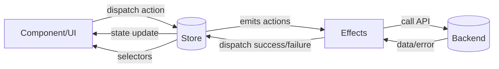

# NgRx — State management cho Angular

NgRx là thư viện quản lý state cho Angular, dựa trên mô hình **Redux**: state tập trung, thay đổi qua **actions** và **reducers**, side effect qua **effects**. Bài này trình bày cách dùng NgRx từ cài đặt đến pattern thực tế.

## Mục lục
1. [NgRx là gì? (Cho người mới)](#ngrx-là-gì-cho-người-mới)
2. [Ví dụ trực quan: Dispatch action → reducer → màn hình đổi](#ví-dụ-trực-quan-dispatch-action--reducer--màn-hình-đổi)
3. [NgRx là gì? (chi tiết)](#ngrx-là-gì-chi-tiết)
4. [Cài đặt và cấu hình](#cài-đặt-và-cấu-hình)
5. [Actions](#actions)
6. [Reducers](#reducers)
7. [Selectors](#selectors)
8. [Effects](#effects)
9. [Feature state và Store](#feature-state-và-store)
10. [Dùng trong Component](#dùng-trong-component)
11. [Best practices và Testing](#best-practices-và-testing)
12. [Câu hỏi thường gặp](#câu-hỏi-thường-gặp)

---

## NgRx là gì? (Cho người mới)

- **NgRx** = thư viện quản lý **state** theo kiểu **Redux**: toàn bộ state (hoặc từng feature) nằm trong **Store** (một object read-only). Thay vì component gọi service và set biến, component **dispatch action** (ví dụ “thêm vào giỏ”), **reducer** (hàm thuần) tính state mới từ state cũ + action, **selector** đọc state để hiển thị. **Effect** xử lý việc bất đồng bộ (gọi API), xong dispatch action success/error để reducer cập nhật state.
- **Khi nào dùng:** State phức tạp, nhiều nơi cập nhật, cần trace “action nào → state thay đổi thế nào” (debug, time-travel). Form đơn giản, CRUD nhỏ thường **service + signal** (bài 10) là đủ; không bắt buộc NgRx.
- **Luồng trực quan:** Component dispatch action → Reducer cập nhật state → Component đọc qua selector → template hiển thị. Nếu cần API: Effect lắng action → gọi API → dispatch action kết quả → Reducer cập nhật.

---

## Ví dụ trực quan: Dispatch action → reducer → màn hình đổi

Sau khi cài NgRx và tạo một slice đơn giản (ví dụ counter: action `increment`, reducer cộng 1 vào state, selector `selectCount`). Trong component: `count$ = this.store.select(selectCount);` và template `{{ count$ | async }}`, nút bấm `(click)="store.dispatch(increment())"`. Chạy app: mỗi lần bấm nút, số trên màn hình tăng — **dispatch action** → **reducer** thay đổi state → **selector** trả giá trị mới → **async pipe** cập nhật view. Đó là luồng NgRx trực quan. Mở **Redux DevTools** (extension trình duyệt) khi có @ngrx/store-devtools: mỗi lần dispatch bạn thấy action và state trước/sau — hỗ trợ debug.

---

## NgRx là gì? (chi tiết)

- **Store**: Một nguồn sự thật (single source of truth) — state toàn app (hoặc từng feature) nằm trong object read-only.
- **Action**: Sự kiện mô tả “điều gì xảy ra” (ví dụ `[Products] Load`, `[Cart] Add Item`). Component hoặc Effect **dispatch** action.
- **Reducer**: Hàm **pure** `(state, action) => state mới`. Không gọi API, không mutate state; trả về state mới (immutable).
- **Effect**: Xử lý **side effect** (HTTP, router, localStorage). Lắng nghe action, gọi API/async, sau đó dispatch action thành công/thất bại.
- **Selector**: Hàm đọc state (hoặc derived data) từ store. Có thể memoize (createSelector) để tránh tính lại không cần thiết.

Luồng điển hình: **Component dispatch action** → **Reducer cập nhật state** → **Selector cung cấp data cho component**. Nếu cần gọi API: **Effect** lắng action → gọi API → dispatch action load success/error → **Reducer** cập nhật state.

---

## Cài đặt và cấu hình

```bash
# cài store (state container)
ng add @ngrx/store
# cài effects (side-effects)
ng add @ngrx/effects
```

```bash
# cài qua npm nếu không dùng ng add
npm install @ngrx/store @ngrx/effects
```

```typescript
import { provideStore } from '@ngrx/store';
import { provideEffects } from '@ngrx/effects';
import { reducers } from './store/reducers';  // tổng hợp reducers
import { AppEffects } from './store/effects/app.effects';

bootstrapApplication(AppComponent, {
  providers: [
    provideStore(reducers), // đăng ký root store với reducers
    provideEffects(AppEffects), // đăng ký effects toàn app
  ],
});
```

---

## Actions

Dùng **createAction** với payload (optional). Convention: `[Feature] Action Type`.

```typescript
// product.actions.ts
import { createAction, props } from '@ngrx/store';
import { Product } from '../models/product';

export const loadProducts = createAction('[Products] Load'); // action không payload
export const loadProductsSuccess = createAction(
  '[Products] Load Success',
  props<{ products: Product[] }>(), // payload danh sách sản phẩm
);
export const loadProductsFailure = createAction(
  '[Products] Load Failure',
  props<{ error: string }>(), // payload lỗi
);

export const addToCart = createAction(
  '[Cart] Add Item',
  props<{ product: Product; quantity?: number }>(), // payload sản phẩm và số lượng
);
export const removeFromCart = createAction(
  '[Cart] Remove Item',
  props<{ productId: number }>(), // payload id sản phẩm
);
```

- Không payload: `createAction('[Products] Load')`.
- Có payload: `props<{ ... }>()`. TypeScript sẽ infer type khi dispatch.

---

## Reducers

Reducer là hàm nhận **state hiện tại** và **action**, trả về **state mới** (immutable). Dùng **createReducer** và **on** để map action → cập nhật state.

```typescript
// product.reducer.ts
import { createReducer, on } from '@ngrx/store';
import * as ProductActions from './product.actions';
import { ProductState, initialProductState } from './product.state';

export const productReducer = createReducer(
  initialProductState, // state khởi tạo
  on(ProductActions.loadProducts, state => ({
    ...state,          // giữ immutable
    loading: true,     // bật loading khi load
    error: null,       // reset lỗi
  })),
  on(ProductActions.loadProductsSuccess, (state, { products }) => ({
    ...state,
    products,          // ghi dữ liệu mới
    loading: false,    // tắt loading
    error: null,
  })),
  on(ProductActions.loadProductsFailure, (state, { error }) => ({
    ...state,
    loading: false,    // tắt loading khi lỗi
    error,             // lưu lỗi
  })),
);
```

```typescript
// product.state.ts
import { Product } from '../models/product';

export interface ProductState {
  products: Product[];     // danh sách sản phẩm
  loading: boolean;        // trạng thái tải
  error: string | null;    // lỗi nếu có
}

export const initialProductState: ProductState = {
  products: [],            // mặc định rỗng
  loading: false,          // chưa tải
  error: null,             // chưa có lỗi
};
```

```typescript
// store/reducers/index.ts
import { ActionReducerMap } from '@ngrx/store';
import { productReducer } from '../features/products/store/product.reducer';
import { cartReducer } from '../features/cart/store/cart.reducer';

export interface AppState {
  products: ProductState;  // slice products
  cart: CartState;         // slice cart
}

export const reducers: ActionReducerMap<AppState> = {
  products: productReducer, // map key -> reducer
  cart: cartReducer,
};
```

---

## Selectors

Selector đọc state (hoặc derived data). **createFeatureSelector** lấy slice feature; **createSelector** để memoize và kết hợp nhiều selector.

```typescript
// product.selectors.ts
import { createFeatureSelector, createSelector } from '@ngrx/store';
import { ProductState } from './product.state';

export const selectProductState = createFeatureSelector<ProductState>('products'); // lấy slice products

export const selectAllProducts = createSelector(
  selectProductState,
  state => state.products, // trả về list sản phẩm
);

export const selectProductsLoading = createSelector(
  selectProductState,
  state => state.loading, // trả về loading
);

export const selectProductError = createSelector(
  selectProductState,
  state => state.error, // trả về lỗi
);

// Derived: sản phẩm có số lượng > 0
export const selectInStockProducts = createSelector(
  selectAllProducts,
  products => products.filter(p => p.stock > 0), // filter derived data
);
```

- **createSelector**: Chỉ tính lại khi tham số (các selector con) thay đổi → tránh re-compute không cần thiết.

---

## Effects

Effect lắng nghe action, thực hiện side effect (HTTP, router), rồi dispatch action mới. Dùng **createEffect** và **ofType**, trả về Observable action (hoặc `{ dispatch: false }` nếu không dispatch).

```typescript
// product.effects.ts
import { Injectable } from '@angular/core';
import { Actions, createEffect, ofType } from '@ngrx/effects';
import { of } from 'rxjs';
import { map, catchError, exhaustMap } from 'rxjs/operators';
import { ProductService } from '../product.service';
import * as ProductActions from './product.actions';

@Injectable()
export class ProductEffects {
  private actions$ = inject(Actions); // stream action
  private productService = inject(ProductService); // service gọi API

  loadProducts$ = createEffect(() =>
    this.actions$.pipe(
      ofType(ProductActions.loadProducts), // chỉ lắng nghe loadProducts
      exhaustMap(() =>
        this.productService.getAll().pipe( // gọi API lấy sản phẩm
          map(products => ProductActions.loadProductsSuccess({ products })), // dispatch success
          catchError(err => of(ProductActions.loadProductsFailure({ error: err.message }))), // dispatch failure
        ),
      ),
    ),
  );
}
```

- **ofType(loadProducts)**: Chỉ xử lý khi action là `loadProducts`.
- **exhaustMap**: Bỏ qua request mới nếu request cũ chưa xong; dùng **switchMap** nếu muốn hủy request cũ khi có action mới.
- Effect **phải** trả về Observable; dùng **of()** hoặc **map** để dispatch action. Không dispatch: `createEffect(..., { dispatch: false })`.

**Đăng ký Effects:**

```typescript
// app.config.ts
import { ProductEffects } from './features/products/store/product.effects';

provideEffects([ProductEffects]), // đăng ký effects
```

Feature state (lazy): đăng ký effects trong route hoặc feature provider.

---

## Feature state và Store

Để tách state theo feature (và lazy load), dùng **StoreModule.forFeature** (NgModule) hoặc **provideState** (standalone).

**Standalone (Angular 16+):**

```typescript
// app.config.ts
import { provideState } from '@ngrx/store';
import { productReducer } from './features/products/store/product.reducer';
import { ProductEffects } from './features/products/store/product.effects';

providers: [
  provideStore(),  // root store (rỗng)
  provideState('products', productReducer), // đăng ký feature state products
  provideEffects([ProductEffects]), // đăng ký effects cho feature
],
```

Hoặc đăng ký feature state trong route (lazy):

```typescript
// products.routes.ts
import { provideState } from '@ngrx/store';
import { productReducer } from './store/product.reducer';
import { ProductEffects } from './store/product.effects';

export const routes: Routes = [
  {
    path: '',
    loadComponent: () => import('./product-list.component').then(m => m.ProductListComponent),
    providers: [
      provideState('products', productReducer), // register feature state trong route
      provideEffects([ProductEffects]), // register effects cho route
    ],
  },
];
```

---

## Dùng trong Component

**Dispatch action:** inject **Store**, gọi `store.dispatch(action())`.

**Đọc state:** inject **Store**, dùng **select** với selector (trả về Observable) hoặc **selectSignal** (Angular 16+, trả về Signal).

```typescript
import { Component, inject } from '@angular/core';
import { Store } from '@ngrx/store';
import { loadProducts } from './store/product.actions';
import { selectAllProducts, selectProductsLoading } from './store/product.selectors';

@Component({ ... })
export class ProductListComponent {
  private store = inject(Store); // inject store

  products = this.store.selectSignal(selectAllProducts); // signal từ selector
  loading = this.store.selectSignal(selectProductsLoading); // signal loading

  ngOnInit() {
    this.store.dispatch(loadProducts()); // dispatch action load
  }

  addToCart(product: Product) {
    this.store.dispatch(addToCart({ product })); // dispatch action add
  }
}
```

```html
@if (loading()) {
  <p>Đang tải...</p>
} @else {
  @for (p of products(); track p.id) {
    <app-product-card [product]="p" (addToCart)="addToCart(p)" />
  }
}
```

Với Observable (cách cũ): `this.store.select(selectAllProducts).subscribe(...)` hoặc dùng `| async` trong template.

---

## Best practices và Testing

- **Action naming**: `[Feature] Verb` (e.g. `[Products] Load Success`).
- **Immutable state**: Luôn trả về object/array mới trong reducer; không mutate.
- **One level slice**: State shape phẳng theo feature; tránh lồng sâu.
- **Selector memoization**: Dùng createSelector cho derived data.
- **Effect error**: Luôn catchError và dispatch action failure để reducer ghi error.
- **Testing reducer**: Gọi reducer với state + action, assert state mới. Testing effect: mock Actions và service, assert dispatch action.

```typescript
// product.reducer.spec.ts
describe('productReducer', () => {
  it('should set loading on loadProducts', () => {
    const state = productReducer(initialProductState, loadProducts()); // reducer với action
    expect(state.loading).toBe(true); // assert loading
  });
});
```

---

## Câu hỏi thường gặp

**Khi nào nên dùng NgRx?**  
State phức tạp, nhiều nơi đọc/ghi, cần trace action (debug, log), team quen Redux. Form đơn giản hoặc CRUD nhỏ có thể chỉ cần service + signal.

**Reducer có được gọi API không?**  
Không. Reducer phải pure. Gọi API đặt trong Effect; Effect dispatch action success/failure, reducer chỉ cập nhật state.

**selectSignal vs store.select?**  
selectSignal (Angular 16+) trả về Signal, dùng trong template trực tiếp (không cần async pipe). store.select trả về Observable, dùng với async pipe hoặc subscribe.

**Feature state có bắt buộc lazy load không?**  
Không. Có thể provideState ở root. Lazy load feature state giúp giảm bundle và load state chỉ khi vào feature.

**So sánh NgRx với Akita / NgRx Signal Store?**  
Akita ít boilerplate hơn. **NgRx Signal Store** (Angular 16+) là API mới của NgRx, dùng signal, ít boilerplate hơn Store + Actions/Reducers/Effects truyền thống; có thể dùng kết hợp hoặc thay thế cho use case đơn giản hơn.

---

→ Chi tiết state tổng quan: [10 - State & Kiến trúc](10-state-architecture.md)  
→ **Checklist phỏng vấn Senior** (gồm NgRx): [15 - Master Angular](15-master-angular.md#checklist-phỏng-vấn-senior-angular)  
→ Tiếp theo UI: [11 - UI & Styling](11-ui-styling.md)

## Luồng giao tiếp (NgRx end-to-end)

```text
[Component/UI]
     |
     | dispatch action
     v
   [Store] <--- selectors ---\
     |                        |
     | state update           |
     v                        |
[Component/UI]                |
                              |
               actions stream |
                              v
                           [Effects]
                              |
                              | call API
                              v
                           [Backend]
                              |
                              | data/error
                              v
                           [Effects]
                              |
                              | dispatch success/failure
                              v
                            [Store]
```



## Cách sử dụng chi tiết (từ đầu đến cuối)

1. **Define state**: tạo `ProductState` + `initialState` cho feature.
2. **Define actions**: mô tả các sự kiện (load, success, failure, add/remove).
3. **Reducer**: map action → state mới, giữ immutable.
4. **Selector**: trích state/derived data cho UI.
5. **Effect**: lắng action, gọi API, dispatch success/failure.
6. **Register**: `provideStore` + `provideState` + `provideEffects`.
7. **Component**: dispatch action, đọc selector (signal/observable).
8. **DevTools**: quan sát action/state để debug.

---
